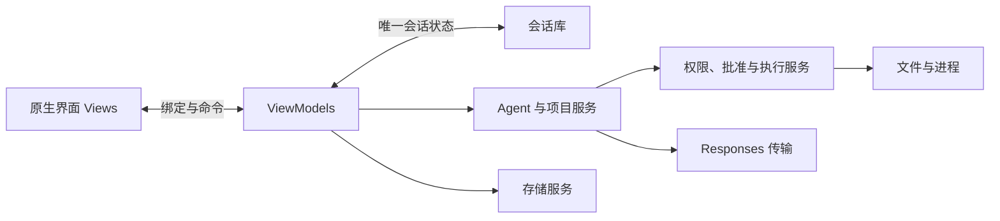

# Avalonia 逐课复刻路线

规划日期：2026-10-06。状态：路线已编写，工程和课程尚未实施。

适用观众：有 C# 基础、Avalonia 入门。首个平台是 Windows；这一轮复刻当前 Electron 版第44课及第三次整理后的产品，不提前加入后续功能。范围以[功能盘点](00-当前功能盘点与复刻边界.md)为准。

## 1. 如何复刻

建议44课主线，加2课终端兼容篇。每课完成一个可观察结果，沿着“原版操作 → 新版实现 → 同一场景验收”推进。新课号属于 Avalonia 系列，不逐号搬运 Electron 的学习历史。

UI 用 Avalonia 控件、XAML、Styles 和资源实现；请求、存储、文件及进程用 C#/.NET 实现。沿用原版的工具协议、会话格式、提示词规则、权限政策和保护条件。原版经过几次重构后的职责可直接参考，避免再次经历旧展示方案和目录迁移。

第一课核对并锁定受支持的 .NET LTS 与 Avalonia 稳定版本。当前机器检测到 .NET SDK 9.0.301，这只是环境事实，不能当作录制版依赖已确定或 Avalonia 已运行。具体版本在创建工程时确认，随后各课固定使用同一套版本。

## 2. 技术对应与最小结构

| 当前实现                  | Avalonia 对应                                     | 保持的行为                                                  |
| ------------------------- | ------------------------------------------------- | ----------------------------------------------------------- |
| React/TSX 组件            | XAML View、DataTemplate 和控件                    | 当前布局、文案、可见入口和操作结果                          |
| Props、回调、受控输入     | Binding、Command、ViewModel 属性                  | 明确输入和输出，发送被拒绝保留草稿                          |
| `useState`、会话控制器    | 唯一会话库状态与 ViewModel                        | 不复制会话库，不因展示组件拆分产生第二份状态                |
| Effect 与取消订阅         | 窗口/View 生命周期、事件解绑、Dispose             | 旧请求和已销毁视图不能更新新状态                            |
| Electron main/preload/IPC | 原生应用服务的明确方法与返回类型                  | 用服务调用承担业务边界；不模拟浏览器 IPC 或复制47个桥接方法 |
| 浏览器增量事件            | .NET 流式读取与 UI 线程调度                       | 请求/会话/任务身份、取消与迟到结果过滤                      |
| `fetch`、Responses SSE    | HttpClient、流读取、CancellationToken             | 同一 Responses 协议；正式聊天与工具请求共用真实 SSE         |
| 版本化 JSON 存储          | System.Text.Json 与串行文件存储                   | 版本6、V1–V5迁移、原字节备份和损坏保护                      |
| Node 文件 API             | FileStream、路径检查、必要的 Windows 文件句柄信息 | 完整读取、哈希、链接/硬链接、文件身份和提交前复核           |
| Node `spawn`              | Process/ProcessStartInfo 与共用命令执行服务       | 独立参数、cwd、环境、输出限制、超时及取消回执               |
| 浏览器 dialog/popover     | 原生菜单与输入区锚定浮层                          | 同宽、上方、右下按钮、Escape/焦点规则                       |
| `xterm` + `node-pty`      | 原生终端显示与 Windows ConPTY                     | 真正的交互终端；不拿普通 stdout 文本框充当等价能力          |

MVVM 建议使用 CommunityToolkit.Mvvm 简化属性通知和命令，业务服务使用普通 C# 类与明确接口。HTTP、JSON、取消和程序执行优先使用 .NET 自带能力。Markdown 和终端控件在对应课程前做原生显示与行为验证，再锁定所需依赖；尚未验证的控件不能记为已选定或已兼容。

先保留一个 Avalonia 应用项目；协议、文件及生命周期需要隔离验证时再建立测试项目。目录按下图的实际职责逐步长出来，不在第一课生成整套空模块或多层空工程。

```text
ZoneCodex.Avalonia/                # 目标结构，当前未创建
├─ Models/                        # 会话、消息、协议、任务及权限数据
├─ Views/                         # 工作台、聊天、会话、审查、执行等原生界面
├─ ViewModels/                    # 唯一会话状态与页面协调
├─ Services/
│  ├─ Model/                      # Responses、SSE、标题与风险评估
│  ├─ Storage/                    # 会话存储、迁移、保存与备份
│  ├─ Project/                    # 工作区、附件快照和项目指令
│  └─ Execution/                  # 任务、批准、文件操作和共用命令底层
├─ Platform/Windows/              # 确实需要的文件身份与 ConPTY 适配
└─ Styles/                        # 原版颜色、字体、布局和控件状态
```



这是同一原生应用内的职责分工，不是 Electron 的多进程隔离，也不是操作系统沙箱。后台 I/O 不占住 UI 线程；流式增量和可观察集合更新回到 UI 线程。

## 3. 第1–8课：先建立可操作的原生工作台

| 课  | 本课内容                    | 完成效果与验收                                                                                 | 参考原版            |
| --- | --------------------------- | ---------------------------------------------------------------------------------------------- | ------------------- |
| 1   | 环境、项目入口与职责        | 创建并运行 Avalonia 应用；能找到 App、MainWindow、ViewModel 与服务接线；记录版本               | 入口与第三次整理    |
| 2   | XAML 布局与工作台骨架       | 标题栏、侧栏、聊天区和输入区布局；正常与680×560窗口不遮挡输入                                  | 工作台布局          |
| 3   | Binding 与消息模板          | 用户/助手消息、ObservableCollection 和属性通知；追加消息不丢失                                 | 原第2课             |
| 4   | Command、异步操作和服务调用 | 发送接受/拒绝返回明确；原生选择器取消可恢复；界面不直接做文件/网络业务                         | 原第3–4课           |
| 5   | 窗口控件与样式资源          | 最小化、最大化/还原、关闭、侧栏展开/遮罩和空状态建议；使用当前配色和图标布局                   | 标题栏、App、样式   |
| 6   | 输入框、快捷键和中文输入法  | Enter/Shift+Enter、空白/超长拒绝、组合输入确认不误发；向上浏览不强制贴底；先用隔离回复夹具验证 | 原第36课            |
| 7   | 多会话身份与独立草稿        | 新建/切换，空白工作台首次发送创建正确会话；A/B草稿独立，只有接受才清空                         | 原第13–14、34、36课 |
| 8   | 本地标题与会话管理          | 首次本地标题、重命名、标题/消息搜索、置顶、归档/恢复、100条限制；无永久删除                    | 原第35课            |

第3–8课的固定回复是学习与隔离测试夹具，正式产品不增加“模拟聊天”切换。中文输入法需要在真实 Windows 输入法中观察；不能直接照搬浏览器的 `keyCode === 229`。

## 4. 第9–18课：真实聊天、展示与保存

| 课  | 本课内容                      | 完成效果与验收                                                                                             | 参考原版                    |
| --- | ----------------------------- | ---------------------------------------------------------------------------------------------------------- | --------------------------- |
| 9   | 模型配置与 Responses 传输准备 | 配置从本地读取；HTTPS/凭据/重定向策略、请求载荷和响应流生命周期明确；缺配置和HTTP失败如实展示              | 原第5课、response-client    |
| 10  | 多轮聊天与请求状态            | 完整成功问答参与上下文，失败/停止不参与；生成中重复提交拒绝，状态可以恢复                                  | 原第6、9课                  |
| 11  | SSE 解码、分帧和严格终态      | UTF-8跨块、分帧、多事件、错误与完成判定通过隔离验证；不把任意文本当成功响应                                | 原第8课、sse                |
| 12  | 正式流式聊天与停止            | 同一输入框显示真实增量；取消网络和本轮状态，旧增量不串入其他会话                                           | 原第9课及统一流式           |
| 13  | 消息复制、末条编辑和聊天重试  | 仅末条用户消息可编辑后发送；聊天失败/取消在来源有效时可重试；刷新后不恢复资格                              | 原第36、38、41课            |
| 14  | 原生 Markdown、代码块与外链   | GFM、只读任务列表、代码语言标签/复制、表格滚动；HTML禁用、图片占位、外链协议校验；不新增高亮或自动图片加载 | 原第15、41课                |
| 15  | 版本6存储与旧版迁移           | 完整V6数据契约、V1–V5解析/备份迁移、手动保存、损坏不覆盖；协议/scope字段在此定义                           | 原第10、13–14、20、35、43课 |
| 16  | 空闲自动保存与失败重试        | 10秒防抖、串行写入、失败暂停/手动重试；保存不能覆盖随后产生的新状态                                        | 原第11课                    |
| 17  | 关闭保护与生命周期            | 继续编辑、不保存关闭、保存后关闭；生成/审批/提交中按实际状态处理，不重复关闭                               | 原第12课                    |
| 18  | 独立 AI 标题与人工优先        | 本地标题回退；后台标题不阻塞聊天；人工重命名、代次、取消、迟到和来源保护                                   | 原第37课                    |

第9课建立传输能力，第11–12课完成真实流式回答，最终正式入口始终使用 Responses SSE。第13课先验收无文件/命令副作用的聊天重试，第27–43课持续补齐任务、权限、路径和副作用保护，不把早期重试条件当最终条件。

第15课直接采用当前V6，并实现兼容读取；不让新工程连续重做五次磁盘格式演进。第22课复用这些协议类型完成运行时历史选择。JSON内完整模型输出要保持；使用 JsonElement 时处理所属 JsonDocument 的生命周期，不能因文档释放丢失 reasoning/phase/额外协议字段。

Avalonia 使用自己的应用数据目录，内部保持 `chats/<conversationId>/workspace` 结构。旧版数据用副本和测试样本验收兼容，不让两份应用同时写同一个会话文件，也不为此增加产品导入流程。

## 5. 第19–28课：项目上下文、工具循环与任务

| 课  | 本课内容                    | 完成效果与验收                                                                                 | 参考原版                  |
| --- | --------------------------- | ---------------------------------------------------------------------------------------------- | ------------------------- |
| 19  | 默认目录与可选工作区        | 每会话稳定默认目录；选择/清除工作区；目录信息与运行授权分开，未选工作区仍可聊天                | 原第39、43课              |
| 20  | AGENTS.md 与统一 Agent 规则 | 工作区/默认目录根读取、64KiB前缀和完整字节指纹；缺失/错误/工作区指纹变化处理；项目文本不能扩权 | 原第39、42–43课           |
| 21  | 附件菜单、卡片与只读快照    | 原生多选、追加/移除、8文件/32KiB/128KiB限制；消息附件元信息与会话授权分开                      | 原第21、40–41课及附件整合 |
| 22  | 完整协议历史与范围隔离      | 保留output/reasoning/phase/function_call_output；按scope选历史；失败轮不能污染上下文           | 原第20、43课              |
| 23  | 最小工具循环与时间工具      | function_call校验、一次一个工具、重复call_id拒绝；时间工具真实输出并有基础活动展示             | 原第18课                  |
| 24  | 工具循环接入同一聊天入口    | 普通聊天和工具聊天同传输/停止/进度；统一规则/清单按实际能力组装，不造第二个输入框              | 原第19、42课              |
| 25  | 本地列出、搜索和读取        | 三个本地只读工具支持相对/绝对路径；敏感名称、链接、容量、深度和结果限制有效                    | 原第42–43课               |
| 26  | 附件快照读取与搜索          | 两个附件工具只查询清单内快照，行号引用、结果截断、刷新/撤销失效；不伪装成目录授权              | 原第21课                  |
| 27  | 任务记录与单次终态          | 业务服务持有权威任务状态；请求、会话和任务身份一致；迟到事件不能重新打开终态                   | 原第31–34课               |
| 28  | 取消、超时和恢复对账        | 本轮停止/4分钟运行计时、缺失运行句柄收敛；View重建/启动对账；不恢复旧进程或批准                | 原第32–33、38课           |

原版“刷新”在 Avalonia 中对应视图/控制器重建与应用重新打开后的恢复验证，不增加一个浏览器刷新按钮。草稿不写入磁盘；窗口级权限在窗口生命周期内回读，关闭后清理，重启不恢复上次一次批准。

第20课保留两条指令读取分支：已选工作区请求时复核已登记指纹，变化后要求重新读取；未选工作区则在请求中读取默认目录根的当前 AGENTS.md。两条都只读取根目录，不递归继承，也不为默认目录增加新的指令管理界面。

这阶段先形成5个读取工具和1个时间工具，第31、33、37课再加入写入/编辑/命令，并在第34、38课增加兼容提案工具。第23–28课已有基础活动反馈，第41课统一最终标签、结果和视觉。工具活动只来自实际调用和结果，不把模型思考或随便写的动画当执行证据。

## 6. 第29–36课：权限、人工批准与文件修改

| 课  | 本课内容                       | 完成效果与验收                                                                                                           | 参考原版               |
| --- | ------------------------------ | ------------------------------------------------------------------------------------------------------------------------ | ---------------------- |
| 29  | 权限策略、revision与三模式菜单 | allow/review/ask/deny，范围与政策分开；方向键/Home/End/Escape、焦点返回、选中/失效回读；auto未接好时拒绝切换并保留原模式 | 原第30、43课           |
| 30  | 输入框上方人工批准浮窗         | 原同宽/位置/按钮和详情；一次批准、回应ID、取消、焦点/Escape；审批等待暂停本轮执行计时                                    | 原第43课界面及单次批准 |
| 31  | 安全新建本地文件               | create_workspace_file：已有父目录、独占新建不覆盖、小文本；范围内直接写、范围外批准；副作用尝试标记                      | 原第42–43课            |
| 32  | 完整读取、编辑准备与冲突       | 本轮完整读取才可编辑；SHA-256、普通文件/链接/硬链接及身份复核；编码/BOM/换行和候选内容规则                               | 原第24、42–43课        |
| 33  | 共用提交服务与本地编辑工具     | 复用准备、暂存、原字节备份、替换前复核与回读；edit_workspace_file真实生效；失败/未知结果不报成功                         | 原第25、42–43课        |
| 34  | 附件修改建议与消息关联         | propose_file_change只产生当前快照的建议；完整读取登记、候选与会话来源校验；不会直接写磁盘                                | 原第23课               |
| 35  | 差异审查与建议状态             | 原始/新内容行号、未准备/已失效/丢弃状态、焦点返回；普通输入批准仍不展示文件全文                                          | 原第22课与审查面板     |
| 36  | 旧建议的准备、一次提交与回执   | 短期prepared记录、一次领取和确认、取消/来源复核；复用32–33课服务，回执可定位备份                                         | 原第24–25课            |

共用提交结果保留备份信息；第36课旧提案链的回执提供定位备份，原版没有一键自动恢复文件。新建与编辑审批浮窗只显示原因、操作和目标路径；差异全文保留在独立审查功能。

第33课普通文件工具将结果交回工具循环和消息活动；可见的 CommitReceipt 属于旧提案提交链，在第36课接入。两条业务路径共用文件底层，不为普通工具新增一个回执面板。

第28课的4分钟计时在风险评估/人工批准等待时清除，恢复运行后重新计时。第30与43课接入这一行为，不把它实现成包含等待在内的总墙钟上限。

不能只用 Path.GetFullPath 或 StartsWith 判断安全。Windows 联接/重解析点、硬链接数量、文件ID、父目录身份和打开句柄需按原版保护条件实测。原版的受控替换也不是跨崩溃事务；原字节备份、取消边界和结果不确定必须如实处理。

## 7. 第37–44课：命令、自动批准与最终收口

| 课  | 本课内容                   | 完成效果与验收                                                                                                         | 参考原版                    |
| --- | -------------------------- | ---------------------------------------------------------------------------------------------------------------------- | --------------------------- |
| 37  | 共用命令底层与通用命令工具 | run_workspace_command：参数分开、不默认Shell包装、cwd复核；30秒/1800字节/环境白名单；取消/权限失效；启动失败仍保护重试 | 原第42–43课与command-runner |
| 38  | 固定 npm 提案与审查卡      | propose_command仍是npm_typecheck；只是建议，不自动运行；卡片来源和模板严格校验                                         | 原第26课                    |
| 39  | 命令目录与配置准备         | 独立选择命令目录，检查package.json/.npmrc与目录身份；短期准备、撤销、一次领取                                          | 原第27课                    |
| 40  | 旧 npm 执行兼容链          | 共用37课底层，保留60秒/256KiB/继承环境和事件回执；缺可信原任务仍人工；一次执行与配置再检查                             | 原第28–30课                 |
| 41  | 原版工具活动与状态展示     | 真实活动、结果、附件摘要和消息操作；顶部简洁运行状态；没有独立任务树/诊断页                                            | 原第38、40–41课             |
| 42  | 独立风险评估器             | 固定本轮任务/具体载荷，无工具/历史；仅严格safe，其他/异常/30秒超时回人工；取消迟到过滤                                 | 原第44课                    |
| 43  | 自动批准接线与三模式闭环   | 范围内、范围外、full、auto逐项验证；评估/人工等待与计时共用；revision、一次批准和执行前复核；副作用后禁重试            | 原第43–44课                 |
| 44  | 视觉对齐与完整交付验收     | 正常/窄窗/DPI、控件与滚动/浮层对齐；端到端、V1–V5样本、取消/故障、重启；发布一个可运行验收版本                         | 第三次整理与当前UI          |

第37课首先验证原生可执行程序的实际退出、stdout/stderr、限额与停止。第40课保持旧npm契约，不因新应用用C#就把它偷换成 `dotnet build`；测试它的目标仍是Node项目，Avalonia自身的构建另行验证。

Windows `.cmd` 不能简单当普通exe启动，也不能为了跑通就静默给所有命令加Shell。原版旧npm真实Windows启动尚未完成专项验收；原生实现的具体启动适配需要在第40课单独验证和记录。若这条真实链没有通过，完整复刻仍有待验收项，不能凭进程替身宣布成功。通用命令的政策与限额继续保持。

三种模式都不等于 OS 沙箱。读取仍执行路径、敏感名称及容量检查；有效可写范围内写入无需额外批准；范围外写入按模式人工/评估处理；无命令隔离后端时受限命令仍需批准。auto只接受严格safe，full也不能绕过格式、文件冲突和来源检查。

## 8. 两课终端兼容篇

| 课  | 内容                     | 验收与最终挂载状态                                                                                      |
| --- | ------------------------ | ------------------------------------------------------------------------------------------------------- |
| C1  | 原生终端显示、键盘和尺寸 | 选定并验证原生终端显示方案，支持所需VT/ANSI、光标/行列/颜色/滚动与输入；在独立学习/验收宿主展示         |
| C2  | ConPTY、PowerShell与清理 | 真正交互输入、resize、输出、退出和句柄清理；与AI命令服务分开；关闭/重建不泄漏进程；最终主工作台仍未挂载 |

这两课复刻的是工程中已有而当前没有主界面入口的能力。普通 Process 输出不能代替 PTY；ConPTY 只提供伪终端后端，屏幕渲染也必须完成。控件选型与平台验证是开录前置项，不能只安装一个NuGet包就标记终端完成。若原生终端方案未验证，这两课保持待实施，也意味着“全工程复刻”仍未完成。

## 9. 每课统一结构

1. 展示原版当前效果与本课目标。
2. 说明本课状态归属、调用过程和前置能力。
3. 用当前课前代码完成一个完整职责，列出实际修改文件。
4. 演示成功与必要的拒绝/错误/取消路径。
5. 核对结果、资源清理和下一课依赖。
6. 给出2–4道自测题及可重复验收步骤。

不从第1课给观众完整后端再“逐步讲解”；课后快照和视频要相互对应。重要代码由学习者能够亲手写出、运行、解释。已有C#语法不是本系列主线，重点是Avalonia绑定、UI线程、桌面生命周期以及Agent业务保护。

## 10. 最终验收口径

完整主线必须覆盖功能盘点里的可见工作台、11工具、旧文件/npm审查链、三种模式及会话生命周期。原生服务中检查参数、磁盘记录与模型输出，不能只依赖绑定类型或按钮禁用。

与原版共用同一组可公开的合成验收场景：空白首次发送、A/B草稿、人工标题优先、流式停止与迟到结果、保存失败/重启、附件/工作区失效、默认目录文件闭环、冲突与一次提交、命令限额/取消、safe与人工回退、副作用后禁重试。模型与文件/进程实际结果分别记录；真实调用不会因离线替身通过就自动算通过。

视频录制版还应能从干净课前代码还原每课结果。构建/运行与发布目录验证属于第44课的交付收尾；自动更新、OS沙箱、SSH、MCP、Skills、图片输入和新的产品流程继续后置。C1/C2也通过之后，才说明当前工程范围已经完整复刻。

下一步是按本路线创建第1课及实际工程，而非直接生成全部成品。合集分篇和拍摄安排见[视频制作方案](02-合集视频制作方案.md)。
