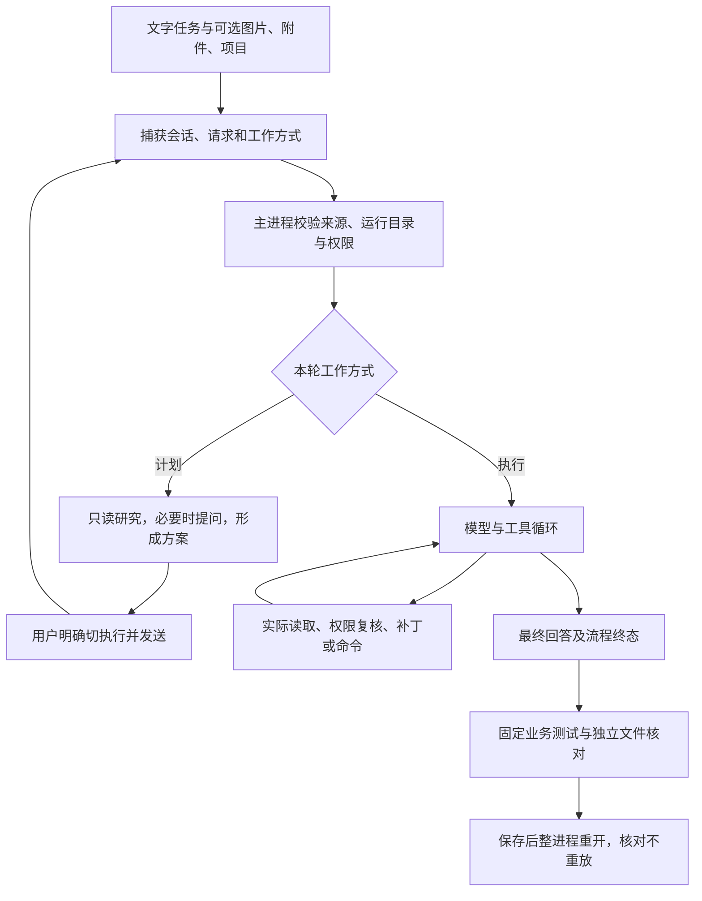

# 第四十五至五十三课小结

2026-10-10 第54课已完成实现与必要分层验收：普通Node可调用的Agent核心已接回原桌面入口，复用唯一工具循环；分层224项、原生IPC8组、renderer四组回归、Node/Web与开发/Windows目录包构建通过。双版真实默认gpt-6.1-sol价格主闭环和已有任务整进程重开零请求通过；合成/真实磁盘/原生IPC/联网结果分别记录。全部本轮失败与观测器EPERM诊断保留，修改后真实红测试再修正两版仍未覆盖，用户完整手工确认待补，八道自测待作答。第55课用户CLI、上下文整理与任务续接继续后置。 实际结果见[第54课实施记录](69-第五十四课-UI与Agent逻辑拆分.md#9-本轮实施与分层验收记录2026-10-10)；下方创建时和旧轮说明按原记录时间阅读。

2026-10-10 最新课程：[第54课：UI与Agent逻辑拆分](69-第五十四课-UI与Agent逻辑拆分.md)已创建，待实现与验收，八道自测待作答。承接已完成的第53课基线、阶段小结和第四次工程整理；本课目标是将固定请求、模型/工具编排、公开事件及结果分离为可在普通Node调用的核心，桌面适配继续负责来源/材料/权限、审批/问答及窗口生命周期。现有唯一工具循环与全部保护保持，第55课用户命令行/脚本入口仍仅安排、未创建；上下文整理与任务续接继续后置。本轮只创建课稿及更新文档，没有实现核心、运行本课真实模型或构建验收，旧失败/未覆盖与全部自测状态保留。下方旧安排按其原记录时间阅读。

2026-10-10 最新工程基线：已按用户要求在第54课前完成[第四次工程整理](68-第四次工程整理-消息展示职责分离与课程衔接.md)，将消息活动的纯展示投影、工具组/详情和折叠返焦点从MessageActivity提取为独立模块，入口保留总过程、计时、重试及legacy兜底。当前界面、状态来源、请求/取消、授权和存储边界保持，实际验收与核验器失败见整理记录。顺序更新为第53课 → 第45～53课小结 → 第四次工程整理 → 第54课 → 第55课；第54课仍负责解除执行核心的窗口依赖，第55课再接命令行/脚本，均尚未创建或实施。旧失败、未覆盖分支和自测待答保持，上下文整理与任务续接继续后置。以下旧安排按其记录时间阅读。

整理日期：2026-10-10。本小结承接[第三十四至四十四课小结](56-第三十四至四十四课小结.md)，以第45～53课实际实施记录和当前源码为依据。用户已确认第53课完成，并要求先进行阶段小结；本阶段已经形成真实单Agent任务完成的基线，各课的未通过项、未覆盖分支和自测待答状态继续保留。

本文完成知识与文档整理。第54课安排UI与Agent逻辑拆分，第55课安排命令行/脚本复用执行核心，均尚未创建或实施；上下文整理与任务续接继续后置。当前路径见[结构地图](02-项目结构地图.md)，最新状态见[学习进度](04-学习进度.md)。

## 1. 这九课完成了什么进阶？

第34～44课让统一聊天能够访问项目、操作文件并经过授权执行。第45～53课进一步回答三个问题：用户怎样提供真实材料，Agent怎样精确修改已有项目，以及怎样证明任务确实完成。

- 第45～46课：接通Windows命令后端，收口公开过程、工具活动与回复交互，让文件引用能够打开右侧只读源码。
- 第47～49课：补齐图片、图片组、拖放、保存与历史追问，建立设置页、稳定的会话目录绑定和默认授权偏好。
- 第50～53课：明确计划与执行边界，支持精确局部补丁、按需片段读取及模型请求重试，再用预先固定的业务测试建立任务验收闭环。

现在已经有一个从文字任务到真实磁盘修改、真实测试、结果核对和重开的完整样本。一次样本通过只证明相应范围；长期运行、所有故障路径和任意项目完成能力仍需各自验证。

## 2. 逐课回顾

| 课程                                                                          | 核心内容                                                                                                               | 当前结果与保留范围                                                                                                             |
| ----------------------------------------------------------------------------- | ---------------------------------------------------------------------------------------------------------------------- | ------------------------------------------------------------------------------------------------------------------------------ |
| [45：Windows命令沙箱与回复交互](58-第四十五课-Windows命令沙箱与受限执行.md)   | 两条命令入口共用单次执行计划、固定官方CLI 0.160.1运行资源及Job监督器；公开过程、工具分组、计时、折叠、高亮、复制和外链 | 执行链、生命周期、双版桌面接线与回复专项已有证据；历史网络隔离探测未通过，不能记完整OS隔离验收通过                             |
| [46：文件引用与源码查看](59-第四十六课-文件引用与源码查看.md)                 | 正文/工具文件引用、显示名与真实地址分开、右侧只读源码、行号定位、来源及键盘焦点                                        | 用户实测确认完成；双版真实读取IPC配合合成消息验收，不冒充真实模型生成引用验收                                                  |
| [47：图片输入与截图问答](60-第四十七课-图片输入与截图问答.md)                 | 单图选择/粘贴、可信预览、真实识图、原图重试；随后补齐图片保存、重开与历史追问                                          | 含补齐实现及真实识图结果，用户实测确认；创建时“图片仅存内存”已是历史                                                           |
| [48：多图输入与图片拖放](61-第四十八课-多图输入与图片拖放.md)                 | 图片组、逐张预览/移除、拖放、完整组请求、原组重试/编辑与保存追问                                                       | 用户实测确认完成；自制双图联机及双版桌面证据分别记录，原生手势的未覆盖范围仍按本课记录                                         |
| [49：设置界面与配置持久化](62-第四十九课-设置界面与配置持久化.md)             | 头像菜单及快捷键设置入口、右侧设置页保留侧栏、统一设置存储、任务根目录、默认授权和PowerShell/cmd                       | 用户实测确认；菜单、侧栏及设置不可编辑问题的修复见[独立记录](62A-第四十九课-实施与验收记录.md)，历史人工清库是一次明确授权操作 |
| [50：计划模式与执行切换](63-第五十课-计划模式与执行切换.md)                   | 计划只读、必要时结构化提问、完整回答后继续方案、明确切执行并发送、原模式重试与编辑改选                                 | 用户实测确认；首版、提问卡及三项行为补充的双版真实验收分别保留                                                                 |
| [51：局部补丁与精确修改](64-第五十一课-局部补丁与精确文件修改.md)             | 单个已有文件、同版本hash、精确唯一上下文、多块整体候选、原字节格式/备份/冲突保护；补齐响应自动重试                     | 用户实测确认；最终两版主闭环通过，早期目录包联网失败及独立标题超时继续保留                                                     |
| [52：按需读取与较大源码补丁](65-第五十二课-按需读取与较大源码文件局部补丁.md) | 当前执行请求的实际可见行凭据、128 KiB补丁文件、未读正文保持；后续取消固定总次数/总时限及跨轮聚合门槛，修复滚动         | 已实现并通过双版必要真实验收；完整用户手工确认仍待补，长历史取消专项与真实长任务分别记录                                       |
| [53：单Agent任务完成与验证](66-第五十三课-单Agent任务完成与验证闭环.md)       | 固定任务合同和受保护测试，单次明确执行内完成修改、实际测试、重读复测与独立核对；整进程重开零请求                       | 双版真实价格主任务及重开通过，手工价格任务独立核验通过，用户确认完成；失败后进一步业务修正仍未覆盖                             |

第45课十二题、第46课十一题、第47课十二题，第48～53课各八题，均按原课程保持待作答；实施完成、测试通过和用户掌握分别记录。

## 3. 从输入到任务完成的实际链路

### 输入、来源和运行上下文

文字、多图、文本附件和工作目录进入同一个聊天入口。发送时捕获原会话、消息、请求、工作方式和材料来源，随后由主进程校验目录、权限及图片/附件身份。文件查看面板提供有界只读展示，不能替代模型实际调用读取工具获得的编辑凭据。



图中的“流程终态”和“业务验收”有各自证据。`runner`更新`completed`表示工具循环正常结束；用户要求是否完成，还要核对业务测试、修改范围及其他验收条件。测试失败时，真实结果可回到同一执行请求继续处理；第53课这条失败后继续修正分支尚未实际覆盖。

### 计划与执行是工作方式，三种授权决定批准策略

计划允许研究与澄清，拒绝目标项目写入、命令和可执行提案。信息充分时直接输出方案；回答提问只是补齐需求，切换模式本身也不发起模型请求。用户明确选择执行并再次发送后，才进入行动流程。聊天与设置保存仍可进行，不能把“计划只读”理解为应用不写任何本地数据。

请求批准、帮我批准、完全访问权限沿用既有三种授权策略；完全访问也不能绕过计划护栏。文件的可写范围、具体操作批准、命令选定的沙箱/升级后端，以及执行前取消/来源/权限版本复核，分别检查。自动风险判断与Windows系统隔离各有职责，批准操作不证明隔离成立。

### 一次已有文件的精确修改

```text
搜索定位 → read_workspace_file返回相关片段及原字节hash
  → 本执行请求记录最终实际可见的完整行
  → apply_workspace_patch提交路径、expectedSha256和局部patch
  → 校验同版本、可见旧文及精确唯一上下文，整体生成候选
  → 原字节/格式/容量与授权复核
  → 备份、提交、读回 → 实际测试 → 重读与重测 → 结果核对
```

搜索摘要、计划轮读取、历史记录和被截断的行不提供本轮补丁凭据。执行器为生成候选读取原文件，和模型实际看见整文件是两件事。补丁只需要充分相关的上下文；未修改正文仍由原字节候选与独立diff核对。成功修改后原读取凭据失效，下一次修改须取得当前版本证据。

## 4. 用Vue经验理解本阶段

| Vue或Web开发经验         | 当前对应概念                                                        | 复习重点                                                   |
| ------------------------ | ------------------------------------------------------------------- | ---------------------------------------------------------- |
| 模板、受控输入和组件事件 | React输入组件、模式控件、图片卡片与设置表单                         | 展示与用户意图由页面负责，系统执行仍由主进程判断           |
| composable组合业务状态   | `useConversation`组合请求、材料、存储；`useChatRequest`协调异步任务 | 找到状态的唯一拥有者，派生值不复制成另一份状态             |
| 前后端DTO及服务接口      | `shared`严格解析、preload业务API、IPC来源校验                       | TypeScript类型不能替代磁盘、IPC或模型返回的运行时校验      |
| 请求取消和过期响应判断   | 请求身份、AbortController、权限revision与迟到隔离                   | 停止后不启动新操作；已开始副作用须核对，迟到结果不复活请求 |
| 乐观并发控制             | 原字节SHA-256、同版本读取凭据与执行前冲突检查                       | 看过旧内容不等于可以覆盖已被外部修改的文件                 |
| 数据仓储和页面恢复       | 会话/图片存储、目录绑定、设置版本                                   | 重开恢复展示数据，不恢复旧批准、等待问题或异步执行         |
| 单元检查与端到端验收     | 补丁/取消合成检查、真实模型任务、受保护业务测试、独立磁盘核对       | 每层只证明其实际观察范围，模型回答不能替代业务结果         |

沿用React、TypeScript、Electron、Node.js、Responses SSE、Markdown/代码高亮和版本化本地存储。第45课增加Windows执行资源与原生Job监督器；后续功能继续沿用同一套请求、工具与授权链。

## 5. 当前源码职责与阅读入口

| 入口                                                                                                                                                                                                                                                | 当前职责                                                                         |
| --------------------------------------------------------------------------------------------------------------------------------------------------------------------------------------------------------------------------------------------------- | -------------------------------------------------------------------------------- |
| [useConversation.ts](../src/renderer/src/features/conversation/useConversation.ts)、[useChatRequest.ts](../src/renderer/src/features/chat/useChatRequest.ts)                                                                                        | 组合会话及材料，捕获请求来源，订阅真实事件，隔离停止/重试/迟到结果，协调消息记录 |
| [useChatWorkspace.ts](../src/renderer/src/features/chat/useChatWorkspace.ts)、[MessageActivity.tsx](../src/renderer/src/features/chat/MessageActivity.tsx)                                                                                          | 草稿、清空/焦点及滚动阅读位置；公开过程和工具活动展示                            |
| [useImageSelection.ts](../src/renderer/src/features/project/useImageSelection.ts)、[image-access.ts](../src/main/project/image-access.ts)、[image-store.ts](../src/main/storage/image-store.ts)、[image-input.ts](../src/main/model/image-input.ts) | 图片选择/粘贴/组归属、可信资源与落盘、当前及历史图片向模型输入的投影             |
| [file-view.ts](../src/shared/file-view.ts)、[file-view-ipc.ts](../src/main/project/file-view-ipc.ts)、[file-view.ts](../src/main/tools/file-view.ts)                                                                                                | 引用协议、消息来源与只读面板请求校验、有界源码读取                               |
| [useSettings.ts](../src/renderer/src/features/settings/useSettings.ts)、[settings-service.ts](../src/main/settings/settings-service.ts)、[settings-store.ts](../src/main/settings/settings-store.ts)                                                | 设置读取/保存状态、主进程统一设置服务、保存成功后的配置更新                      |
| [conversation-directory.ts](../src/main/settings/conversation-directory.ts)、[execution-context.ts](../src/main/execution/execution-context.ts)                                                                                                     | 稳定的会话目录绑定，捕获及复核本次cwd、scope、权限模式和版本                     |
| [agent-api.ts](../src/preload/agent-api.ts)、[agent-ipc.ts](../src/main/agent/agent-ipc.ts)、[agent-runner.ts](../src/main/agent/agent-runner.ts)                                                                                                   | 受限桥接、页面来源和参数校验、任务互斥/上下文及生命周期编排                      |
| [agent-instructions.ts](../src/main/agent/agent-instructions.ts)、[agent-user-input.ts](../src/main/agent/agent-user-input.ts)                                                                                                                      | 本轮指令及工具清单、计划提问和当前窗口/请求的明确答复与取消                      |
| [response-client.ts](../src/main/model/response-client.ts)、[response-retry.ts](../src/main/model/response-retry.ts)、[tool-loop.ts](../src/main/agent/tool-loop.ts)                                                                                | 真实模型传输、临时响应错误重试、工具循环及协议容量保护                           |
| [agent-tools.ts](../src/main/agent/agent-tools.ts)、[workspace-read-evidence.ts](../src/main/agent/workspace-read-evidence.ts)                                                                                                                      | 本轮工具分发、计划护栏、实际可见行和hash证据                                     |
| [workspace-patch.ts](../src/main/tools/workspace-patch.ts)、[change-capacity.ts](../src/main/tools/change-capacity.ts)、[change-commit.ts](../src/main/tools/change-commit.ts)                                                                      | 精确定位与整体候选、大小策略、备份/提交/读回与恢复核实                           |
| [action-authorization.ts](../src/main/execution/action-authorization.ts)、[command-plan.ts](../src/main/execution/command-plan.ts)、[command-runner.ts](../src/main/execution/command-runner.ts)                                                    | 文件/命令授权、绑定具体操作和后端的单次计划、实际程序启动及结果收尾              |
| [windows-command-backend.ts](../src/main/execution/windows-command-backend.ts)、[main.cpp](../native/windows-command-host/main.cpp)                                                                                                                 | 固定Windows运行资源检查，Job进程树、输出、取消与超时监督                         |
| [conversation-library.ts](../src/shared/conversation-library.ts)、[conversation-store.ts](../src/main/storage/conversation-store.ts)、[useConversationTasks.ts](../src/renderer/src/features/conversation/useConversationTasks.ts)                  | 唯一当前会话契约、存储保护、重开后的任务对账与中断展示                           |

当前`agent-runner.ts`仍直接接收`windowId`和Electron `WebContents`，查询窗口权限/材料、处理审批与提问、发送页面事件。`tool-loop.ts`已有回调，整条执行链尚未成为独立无界面核心。这是第54课的具体整理依据。

## 6. 需要记牢的当前规则

### 设置、会话和本次授权分别归属

设置保存默认偏好；会话保存自己的稳定目录与工作方式；本次执行捕获实际运行上下文和权限版本。任务根目录用于新会话、默认授权用于新窗口、Shell用于新PTY；已有会话目录和正在运行的任务保持自己的上下文。PowerShell/cmd设置已有真实PTY接线证据，当前聊天页尚未挂载终端面板，终端入口仍后置。

当前会话仅接受版本9，设置为版本1，消息图片统一使用`images`，合法历史图片关联保留`imageHistory`。旧版本和损坏库拒绝读取与覆盖，应用不自动迁移或清空。第49课人工重置旧记录有当时明确授权；本轮不重复该操作。

### 请求重试与工具重放分开

模型配置默认沿用`gpt-6.1-sol`。临时连接/响应错误允许首次请求后最多5次自动重试，冻结本次请求内容并隔离不同attempt。已完成工具不因这次传输重试再执行。手工整轮重试还须检查原模式、请求来源及已经发生的副作用，等待批准和工具结果未知也不能随意重放。

公开`commentary`、工具调用/结果和最终回答可以展示；协议记录和私有推理不能当作“思考过程”文本。主模型、标题及独立审批请求各自统计；HTTP 200也须继续核对流是否正常完成。

### 已取消的限制与仍保留的保护

| 项目                                         | 当前状态                                                                                                   | 依据                                                                                                        |
| -------------------------------------------- | ---------------------------------------------------------------------------------------------------------- | ----------------------------------------------------------------------------------------------------------- |
| 每任务固定8工具/9模型轮                      | 已取消，不按该固定总次数停止                                                                               | [第52课第11节](65-第五十二课-按需读取与较大源码文件局部补丁.md#11-取消固定工具次数与模型轮次限制2026-10-09) |
| Agent整任务4分钟总时限                       | 已取消；主动停止、取消和上下文失效仍有效                                                                   | [第52课第12节](65-第五十二课-按需读取与较大源码文件局部补丁.md#12-取消agent任务总时限2026-10-09)            |
| 跨轮历史300项/64000字符及图片协议索引小于300 | 独立聚合门槛已取消，索引合法性与实际归属继续校验                                                           | [第52课第15节](65-第五十二课-按需读取与较大源码文件局部补丁.md#15-取消跨轮工具上下文发送限制2026-10-10)     |
| 本轮协议与完整模型输入                       | 本轮含预留结果160项；完整输入序列化128000字符，单轮历史解析仍有对应保护                                    | `tool-loop.ts`与`agent-history.ts`                                                                          |
| 局部补丁文件                                 | 原字节与最终编码候选分别最多128 KiB；规范LF字符预算131072，不要求累计读完全文                              | `change-capacity.ts`与第52课第10节                                                                          |
| 单次读取/补丁与其他小文件用途                | 读取仍有100行/返回预算，patch文本6000字符、序列化参数12000；新建/全文提案仍沿small容量，文本附件原范围保持 | 第51/52课及对应工具参数校验                                                                                 |
| 局部操作期限                                 | Agent工作区单命令30秒、独立命令入口60秒及各审批/准备期限仍保留                                             | `workspace-actions.ts`、`command-execution-ipc.ts`及授权模块                                                |

字符预算、原文件字节、编码候选、图片字节和只读面板预算分别校验。总次数和总时限取消后，任务仍可能触发完整输入容量或局部操作限制；当前没有上下文压缩或自动续接来绕过这些边界。

### 停止与重开保留什么

停止、窗口关闭、刷新或上下文失效先取消当前任务，再隔离迟到事件。保存恢复消息、工具记录、图片及目录信息；未结束的消息/任务按失败或中断展示，不恢复原模型循环、进程、读取凭据、问答等待或批准。

第53课整进程重开后观察5秒，两版主模型、标题、审批请求及命令均为0。这证明该观察窗口内没有任务重放；用户手工价格修复的独立磁盘核验不替代用户手工重开请求统计。

## 7. 已验证、失败与未覆盖

本节汇总已有证据，本次小结不重新发模型任务、运行应用验收或构建。静态/合成检查、真实文件和进程、真实桌面输入、真实模型与用户反馈按各自来源判断，不合并成一个“全通过”数字。

| 范围                     | 已记录的结果                                                                                                       | 保留的边界与失败                                                                                                                                            |
| ------------------------ | ------------------------------------------------------------------------------------------------------------------ | ----------------------------------------------------------------------------------------------------------------------------------------------------------- |
| 第45课命令后端与回复     | 官方路径17项生命周期、监督器8项、双版两入口各19项桌面矩阵及回复专项通过                                            | 桌面矩阵模型请求为0，含合成风险返回；历史网络探测5次连接成功仍是隔离未通过项，完整沙箱模型端到端待补                                                        |
| 第46～49课材料与设置     | 文件查看双版真实读取IPC，图片/多图真实请求与保存追问，设置/目录/终端配置的分层检查及用户确认                       | 已修复损坏PNG被Chromium宽容接受、旧会话库阻断有效设置编辑，原失败保留；克隆包、替身、合成消息和原生手势范围按原记录                                         |
| 第50课计划与执行         | 首版、计划提问卡与后续三项行为的双版真实默认模型闭环分别通过                                                       | 用户确认没有逐项列手工场景；旧准备失败及不完整故障矩阵保持，不据此标自测掌握                                                                                |
| 第51课补丁与重试         | 最终开发/目录包主任务通过，首次＋最多5次重试及工具不重放分层核对                                                   | 早期包TLS/连接超时、EACCES、用户执行HTTP 502、独立标题超时保留；注入503专项不能泛化为全部真实网络故障已覆盖                                                 |
| 第52课按需读取与后续调整 | 双版按需修改、字节/凭据保护及取消次数/总时限的实际验收；滚动专项与跨轮取消专项分层通过                             | 首轮夹具问题与网络恢复保留；跨轮取消专项58项使用合成发送，真实长历史任务未新增覆盖；完整用户实测待补                                                        |
| 第53课主任务             | 开发price单execute为9工具/10完成模型轮；原目录包为7工具/8完成轮。各两次Agent固定8项测试通过，独立最终/重开核对通过 | 一次修对，业务已修改后红测试→继续修正分支两版仍未覆盖；合成保护104/104另记，不充当真实失败修正                                                              |
| 第53课其他真实尝试       | 每版三个预固定合同price/shipping/inventory，另有price后缀准备失败，共8次尝试全部保留                               | 首price使用不可补丁编辑的.mjs，两版各两次patch被拒；shipping观测器竞态取消，虽各两次15项测试通过仍不判完整任务通过；inventory计划流未completed，未发execute |
| 第53课用户手工价格任务   | 独立盘/固定测试核验：只改第85/365行，8项通过，测试/需求/旁路/package及BOM/CRLF/尾换行/备份保持                     | 报告中的两次Agent测试来自用户软件报告，应用版本、默认模型、requestId与用户手工重开未独立确认；用户已确认第53课完成                                          |

核对原记录的入口：

- [第45课实际实施与限制](58-第四十五课-Windows命令沙箱与受限执行.md#9-实施与验收记录2026-10-07)。
- [第47课图片保存与历史追问补齐](60-第四十七课-图片输入与截图问答.md#图片保存与历史追问补齐2026-10-08)、[第48课实施记录](61-第四十八课-多图输入与图片拖放.md#8-实施与验收记录2026-10-08)、[第49课独立验收](62A-第四十九课-实施与验收记录.md)。
- [第50课提问卡验收](63-第五十课-计划模式与执行切换.md#10-计划提问卡补齐与验收2026-10-09)、[三项行为明确化](63-第五十课-计划模式与执行切换.md#12-三项行为明确化与专项验收2026-10-09)。
- [第51课原补丁结果](64-第五十一课-局部补丁与精确文件修改.md#8-实施与验收记录2026-10-09)、[自动重试及保留失败](64-第五十一课-局部补丁与精确文件修改.md#10-响应自动重试补充与独立验收2026-10-09)。
- [第52课双版按需修改](65-第五十二课-按需读取与较大源码文件局部补丁.md#10-实施与验收记录2026-10-09)及第11～15节的后续调整。
- [第53课全部真实结果与复跑方法](66-第五十三课-单Agent任务完成与验证闭环.md#10-本轮实施与验收记录2026-10-10)、[用户手工价格核验](66-第五十三课-单Agent任务完成与验证闭环.md#11-用户手工价格任务报告与独立核验2026-10-10)、[原证据总索引](../.ui-check/lesson53/acceptance-index.md)。

第51/52课旧失败不由后续成功覆盖。第53课一次业务修对也不改写未覆盖失败分支、自测和其他课程的确认状态。

## 8. 复习顺序与第54/55课衔接

先沿输入组件、`useConversation`、`useChatRequest`、preload、IPC和`agent-runner`复述一次明确执行请求。再解释计划为什么不能写入、回答问题为什么不等于执行授权，以及模式切换为什么还需要发送。

接着沿`workspace-read-evidence`、`workspace-patch`、准备/授权/提交解释一次局部修改：模型到底看见哪些行，hash什么时候失效，如何保持未读正文与编码格式，外部冲突为什么会阻止提交。再沿`command-plan`和`command-runner`解释批准、后端选择、实际测试退出码与进程树收尾。

最后用第53课价格任务复述验收：需求和测试先固定，修改后的文件与测试独立核对；Agent两次测试、助手复测和重开零请求有各自证据。失败修正分支保持待补，原课程自测仍待学习者作答，本小结不代填答案。

第54课把必要项目整理集中在UI与Agent职责拆分：窗口身份、页面事件、权限/材料来源、审批/问答及窗口生命周期作为明确适配边界；执行核心负责固定请求、取消信号、模型/工具编排和结果。复用第53课业务合同、三种授权、计划护栏、停止和字节保护进行回归，逐步证明整理后的行为保持。

第55课再让命令行/脚本复用同一核心，明确输入、事件、审批/提问、停止与结果出口。当前阶段只安排顺序；上下文整理/任务续接、MCP、Skills、SSH、并发与远程执行继续后置。

## 9. 本次小结记录

本轮新增第67份阶段小结，并同步学习计划/项目README、路线、结构地图、进度和编写约定；前一阶段小结及第53课增加后续阅读链接。保留所有已有未提交改动、旧失败、自测和用户工作目录，不提交或重置Git，不操作用户会话库。

本轮检查文档格式、本地链接/标题锚点、当前源码职责、事实范围及改前原字节保留；产品源码、依赖和构建产物没有作为小结修改范围。原字节快照和核验记录保存在`.ui-check/lesson45-53-summary/7efcb740-53ea-486e-8efd-9e8ce15c9bd7/`，与课程业务验收证据分开。

实际核验：九份定向文档格式与Git空白检查通过，72份文档的本地链接及标题锚点核对通过；275份非修改范围文件hash保持，八份更新文档的原字节行保持，仅两份README的第53课导航状态按最新反馈更新。第45～49课、第50～53课及源码职责分别经过独立只读审查；修正新小结中停止副作用和设置保存的两处措辞后通过。HEAD及原有未提交状态保持，旧第51/52课全文、自测与失败不改写。详见[本轮校验记录](../.ui-check/lesson45-53-summary/7efcb740-53ea-486e-8efd-9e8ce15c9bd7/validation-53b2557d-891b-4e71-b811-0c527cda91e4/results.json)。

复查方法：在项目根运行`node .ui-check/lesson45-53-summary/7efcb740-53ea-486e-8efd-9e8ce15c9bd7/verify.mjs`，每次另存UUID结果；该脚本只读取Markdown与改前基线并写核验记录，不运行模型、业务测试或构建。后续课程改变源码后应建立新基线，不覆盖这次原记录。
