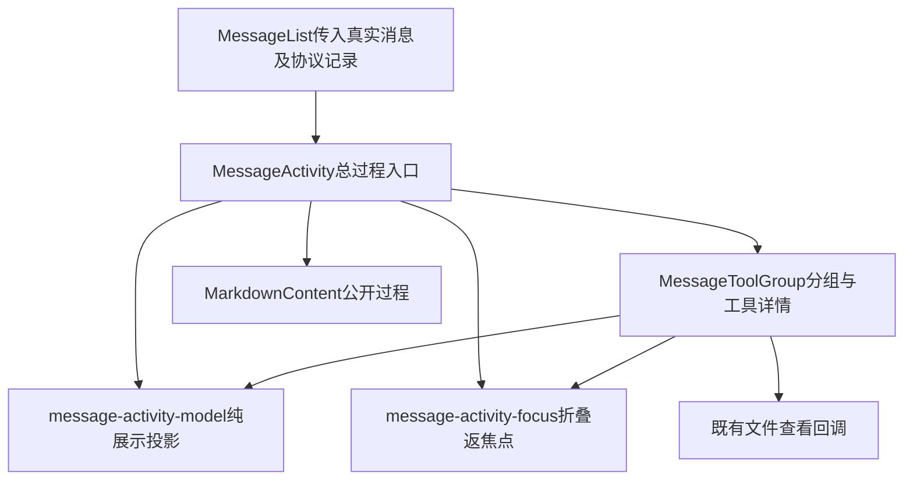

# 第四次工程整理：消息展示职责分离与课程衔接

2026-10-10 第54课已完成实现与必要分层验收：普通Node可调用的Agent核心已接回原桌面入口，复用唯一工具循环；分层224项、原生IPC8组、renderer四组回归、Node/Web与开发/Windows目录包构建通过。双版真实默认gpt-6.1-sol价格主闭环和已有任务整进程重开零请求通过；合成/真实磁盘/原生IPC/联网结果分别记录。全部本轮失败与观测器EPERM诊断保留，修改后真实红测试再修正两版仍未覆盖，用户完整手工确认待补，八道自测待作答。第55课用户CLI、上下文整理与任务续接继续后置。 实际结果见[第54课实施记录](69-第五十四课-UI与Agent逻辑拆分.md#9-本轮实施与分层验收记录2026-10-10)；下方创建时和旧轮说明按原记录时间阅读。

2026-10-10 最新课程：[第54课：UI与Agent逻辑拆分](69-第五十四课-UI与Agent逻辑拆分.md)已创建，待实现与验收，八道自测待作答。承接已完成的第53课基线、阶段小结和第四次工程整理；本课目标是将固定请求、模型/工具编排、公开事件及结果分离为可在普通Node调用的核心，桌面适配继续负责来源/材料/权限、审批/问答及窗口生命周期。现有唯一工具循环与全部保护保持，第55课用户命令行/脚本入口仍仅安排、未创建；上下文整理与任务续接继续后置。本轮只创建课稿及更新文档，没有实现核心、运行本课真实模型或构建验收，旧失败/未覆盖与全部自测状态保留。下方旧安排按其原记录时间阅读。

日期：2026-10-10。承接[第45～53课小结](67-第四十五至五十三课小结.md)，在第54课前完成一次有限的工程整理，不另算一课。本文参考[第一次整理](17-工程整理与工作台布局.md)、[第二次整理](30-工程整理-项目上下文与工作台布局.md)和[第三次整理](57-第三次工程整理方案-统一职责与执行边界.md)，以当前源码核对实际职责；旧文档中的布局、接口和版本说明继续作为历史记录。

## 1. 现在为什么需要整理？

第45～53课加入公开过程、工具分组、计时、文件引用、计划问答历史和重试提示后，`MessageActivity.tsx`达到796行，同时包含纯协议投影、工具状态和摘要计算、工具详情、DOM焦点恢复及总过程编排。它们有清楚的输入输出，适合在第54课进入执行核心前分开阅读和维护。

本轮也核对了会话控制器、请求Hook、preload及主进程。较长文件本身不是拆分理由：会话仍需唯一状态源，请求身份与取消需要统一协调；`agent-runner.ts`的窗口依赖正是第54课要解决的实质问题。此次选择消息展示这一处职责边界，不提前建立无界面执行核心。

前三次整理留下的原则继续适用：先确定模块职责，再移动已有实现；原组件入口继续组装；状态、授权和存储的拥有者保持明确；课程示例通过迁移表找到当前文件，不能恢复旧结构。

## 2. 实际文件迁移表

以下文件均位于`src/renderer/src/features/chat/`。

| 原位置                                                                  | 现在位置                                                                                 | 职责                                                            |
| ----------------------------------------------------------------------- | ---------------------------------------------------------------------------------------- | --------------------------------------------------------------- |
| `MessageActivity.tsx`中的协议投影、标签、目标、状态、分组摘要和耗时格式 | [message-activity-model.ts](../src/renderer/src/features/chat/message-activity-model.ts) | 将已保存或当前协议数据派生为展示数据；不持有React状态或执行工具 |
| 原`ToolGroup`与`ToolItem`                                               | [MessageToolGroup.tsx](../src/renderer/src/features/chat/MessageToolGroup.tsx)           | 原工具分组、详情、已答计划历史、文件按钮与分组交互              |
| 原`restoreCollapsedDetailsFocus`                                        | [message-activity-focus.ts](../src/renderer/src/features/chat/message-activity-focus.ts) | 在折叠内容内仍有焦点时，将焦点返回本层摘要并保持滚动位置        |
| 总过程、计时、重试提示及legacy兜底                                      | [MessageActivity.tsx](../src/renderer/src/features/chat/MessageActivity.tsx)             | 保留公开入口和总过程编排，调用上述模块                          |

入口从796行变为182行；新增模型317行、工具展示319行、焦点辅助13行。行数只说明阅读范围变化，不作为行为或质量验收标准。没有新增运行依赖。

模型文件中的`ToolCall`与`ActivityBlock`是展示投影类型，不是第二套任务/会话状态。现有`ToolActivity`、`PendingPlanQuestion`及主进程执行协议继续由原模块拥有。

## 3. 整理后的调用关系

过程入口保留最终回答出现时的一次自动收起、pending计时、重试倒计时和旧记录兜底。工具组仍以第一个真实`callId`为稳定key，连续工具之间保持同组，公开过程文字分开组。文件查看仍把真实引用、来源和触发按钮交回原查看链。

用Vue经验理解：纯模型相当于从props计算展示数据的工具函数；工具组是独立组件，管理自己的展开状态；焦点辅助只操作DOM；总过程入口相当于组装子组件并管理总过程状态。提取组件时不能改变key，否则React可能重建组件并丢失手动展开状态。

## 4. 保持的行为与边界

- 单工具默认展开；增长到多工具时只执行一次原自动折叠，已有交互和内容焦点按原规则保留。
- 最终回答触发总过程一次自动收起，之后允许手动开合；内层toggle不改变外层状态。
- 折叠时只恢复本层被隐藏内容中的焦点，不抢走外部输入的焦点。
- 文件按钮保留点击及Enter/空格事件隔离，打开源码不能意外开合工具详情。
- 命令非零退出、取消、超时和结果不确定继续显示原真实状态；计划问题的已确认答案按原解析展示。
- 只投影公开commentary及实际工具调用/结果；私有推理、加密内容和内部调用ID继续不进入可见摘要。

请求Hook、会话/图片生命周期、shared/preload/main、API、CSS、布局和存储契约均保持。默认`gpt-6.1-sol`、三种授权、计划护栏、读取凭据、补丁字节格式、冲突与备份、取消和迟到结果隔离继续由原链负责。未重新引入已取消的固定总次数、总时限或跨轮聚合门槛。

## 5. 实施基线与隔离证据

本轮开始时Git干净，HEAD为`37d34ff7185471ba933aeb965ef908e6cf7ac4e3`。先记录284份现有Git文件的SHA256，并保存原组件与八份导航文档的原字节。只允许本表四个产品文件及本轮九份文档改变；不提交、重置Git，不清空用户记录或工作目录。

证据根目录：`.ui-check/engineering4/9b20cf26-1770-4e2f-a95c-899728b56ce9/`。基线见[baseline.json](../.ui-check/engineering4/9b20cf26-1770-4e2f-a95c-899728b56ce9/baseline.json)，原字节见[before目录](../.ui-check/engineering4/9b20cf26-1770-4e2f-a95c-899728b56ce9/before/)。新测试与核验器只写隔离证据目录，已有课程证据保持。

## 6. 已完成验收与实际失败

| 检查                                  | 实际结果                        | 范围                                                                |
| ------------------------------------- | ------------------------------- | ------------------------------------------------------------------- |
| 迁移等价性                            | 两次独立审查均20/20顶层声明等价 | TypeScript语法树仅规范必要export及注释；函数体、JSX、类型与常量保持 |
| 固定消息展示合同                      | 迁移前46/46，迁移后46/46，退出0 | 当前工具名夹具，断言在迁移前固定；实际React静态展示                 |
| 文件引用组件                          | 31项通过，退出0                 | 旧21项及别名补充10项；实际组件/解析器，面板结果为夹具               |
| 重试、计划卡及会话回归                | 42项通过，退出0                 | 隔离真实React/Electron；API、模型结果为替身                         |
| 定向ESLint                            | 四文件退出0，无警告输出         | 本轮改动源码                                                        |
| Node/Web类型、开发构建及Windows目录包 | `npm run build:unpack`退出0     | 构建链实际执行两层类型检查；Windows命令资源复制及签名后hash核验通过 |

以上检查分层记录，不合并成“真实模型全部通过”。本轮没有重新发送第53课真实模型业务任务；第53课双版价格主闭环和整进程重开零请求仍引用原课证据，失败后继续业务修正分支仍未覆盖。第51/52课旧失败和各课自测待答保持。

交互专项补充：原组件与拆分后组件在真实React、隔离Electron/Chromium中各12/12通过，覆盖单工具增长、一次自动折叠、手动展开保持、内外焦点和本地/快照文件按钮的来源与触发元素；浏览器错误、网络尝试和模型请求均0，四个产品文件hash冻结。输入协议props和文件查看回调为受控夹具，这不是产品main/preload或真实磁盘查看器的完整联机验收。详见[独立审查结果](../.ui-check/engineering4/9b20cf26-1770-4e2f-a95c-899728b56ce9/semantic-ui-bf5d5fcf-3c40-4bfd-b867-0d9cffd96d14/review-report.json)及同目录`ui-comparison.json`。

实际开发构建入口与Windows目录包原exe最终各8/8启动检查通过：新UUID空库、默认执行、侧栏/输入框、原头像设置入口及真实设置IPC、返回聊天、至少5秒无请求、正常关闭退出0、产物原字节保持及原生进程日志无ERROR/未处理异常。两版主模型、标题、审批、Agent任务和子进程启动均0；未替换包入口，未读用户库或密钥。该项只证明空库启动/设置/关闭行为，不能替代第53课任务完成或已有任务重开验收。详见[最终双版启动结果](../.ui-check/engineering4/9b20cf26-1770-4e2f-a95c-899728b56ce9/startup-smoke-4e958d0b-2774-4c75-8f56-4abfe34d7524/run-148e5b0c-426f-4a5d-9b88-8fc9459aa578/summary.json)。

本轮核验中保留以下问题：

1. 修改产品前直接运行旧第45课合同失败：夹具仍用已退役的`edit_workspace_file`，当前实现不会为它生成“已修改文件”摘要。原失败及stdout/stderr保留。只在本轮复制合同中将工具名换为`apply_workspace_patch`、根路径改为当前工作目录，全部断言保持；该合同随后在迁移前后各46项通过。适配记录见[component-contract-provenance.json](../.ui-check/engineering4/9b20cf26-1770-4e2f-a95c-899728b56ce9/component-contract-provenance.json)。
2. 独立核验器有两次准备失败：语义核验首轮根路径多退一层，读取原文件失败，见[initial-verifier-failure.json](../.ui-check/engineering4/9b20cf26-1770-4e2f-a95c-899728b56ce9/semantic-ui-bf5d5fcf-3c40-4bfd-b867-0d9cffd96d14/initial-verifier-failure.json)；UI夹具首轮使用不支持plugins的esbuild同步API，见[run-fatal.json](../.ui-check/engineering4/9b20cf26-1770-4e2f-a95c-899728b56ce9/semantic-ui-bf5d5fcf-3c40-4bfd-b867-0d9cffd96d14/run-fatal.json)。仅修核验器路径和夹具异步构建，以新UUID重跑后前后各12项通过；产品没有因此改变。
3. 双版启动首轮14项逻辑断言通过，但原生日志暴露隔离目录嵌套过深导致Chromium缓存及DevToolsActivePort长路径错误，不能判无异常启动通过。原summary/log不改写，另加[superseded.json](../.ui-check/engineering4/9b20cf26-1770-4e2f-a95c-899728b56ce9/startup-smoke-4e958d0b-2774-4c75-8f56-4abfe34d7524/run-810c9af0-bf49-41c9-b508-e18da14ea033/superseded.json)和原生日志复核。缩短隔离路径时，中间一轮因未创建日志目录触发[ENOENT准备失败](../.ui-check/engineering4/9b20cf26-1770-4e2f-a95c-899728b56ce9/startup-smoke-4e958d0b-2774-4c75-8f56-4abfe34d7524/run-50be6226-55c2-4f1b-a83b-5bcd874dc53a/startup-script-error.json)，尚未启动应用。只修测试路径/目录准备并增加原生日志断言后，新UUID最终两版各8项通过；应用源码没有改变。

第46课合同同样在本轮目录适配退役工具名及根路径，结果文件跟随新的目录。它在迁移后固定并运行，仅作为既有文件引用回归，不写成迁移前的固定基线。说明见[file-contract-provenance.json](../.ui-check/engineering4/9b20cf26-1770-4e2f-a95c-899728b56ce9/file-contract-provenance.json)。

实际构建日志中的依赖重复引用提示不影响本次退出结果；本轮未据此改变依赖。尚未重新覆盖真实模型、命令OS隔离、多图原生手势、全部执行故障路径或第53课失败修正分支。

初次文档格式检查提示结构地图新增表格及本整理文档需要对齐，格式化这两份后重新检查；旧八份文档的全部原字节行仍按序保留。

## 7. 证据与复跑方法

在项目根运行。每次完整复跑先创建新UUID证据目录，保留这次日志，不覆盖旧结果。

- 消息合同：复制本轮`message-component-contract.cjs`到新证据目录，再运行`node <新目录>/message-component-contract.cjs --diagnostic`。根路径使用当前工作目录；不要改断言。
- 文件合同：复制本轮`file-reference-component-contract.cjs`到新目录，再运行`node <新目录>/file-reference-component-contract.cjs`；结果写新目录。
- 重试/计划回归：`node .ui-check/lesson51/retry-renderer-check.mjs`，脚本自动创建新UUID，原API和模型替身范围保持。
- 等价/交互：将本轮`semantic-ui-bf5d5fcf-3c40-4bfd-b867-0d9cffd96d14/`内的核验器和fixture源文件复制到本轮证据根下的同级新UUID目录，再运行`semantic-check.cjs`和`run-ui.cjs`，使根路径深度及`../before`快照相同；后者新增`ui-run-UUID`及两份独立userData，汇总也只写新目录。
- 双版启动：`node .ui-check/engineering4/9b20cf26-1770-4e2f-a95c-899728b56ce9/startup-smoke-4e958d0b-2774-4c75-8f56-4abfe34d7524/startup-smoke.mjs`，每次生成新run及两版数据目录；不发送任务。
- 静态及交付：对表中四文件运行定向ESLint/Prettier；`npm run build:unpack`完成Node/Web、开发产物及Windows目录包；日志另存新目录。
- 文档/保护基线：`node .ui-check/engineering4/9b20cf26-1770-4e2f-a95c-899728b56ce9/verify.mjs`，每次新增`validation-UUID/results.json`；核对全部本地链接/标题、保护文件hash、旧文档原字节行、Git范围及固定合同hash。
- 第53课真实业务任务需要另按[原课复跑方法](66-第五十三课-单Agent任务完成与验证闭环.md#10-本轮实施与验收记录2026-10-10)创建隔离项目和固定受保护测试，不复用旧批准或读取凭据。

本轮46项后验收见[after-current-component.stdout.log](../.ui-check/engineering4/9b20cf26-1770-4e2f-a95c-899728b56ce9/after-current-component.stdout.log)，31项文件回归见[file-reference-alias-component-results.json](../.ui-check/engineering4/9b20cf26-1770-4e2f-a95c-899728b56ce9/file-reference-alias-component-results.json)，42项Electron回归见[retry-renderer结果](../.ui-check/lesson51/retry-renderer-a324ce24-4c27-482e-b2b2-b860fe898819/results.json)，构建见[package-build.json](../.ui-check/engineering4/9b20cf26-1770-4e2f-a95c-899728b56ce9/package-build.json)及同目录日志。

## 8. 第54/55课怎样接续？

当前顺序：**第53课完成基线 → 第45～53课小结 → 第四次工程整理 → 第54课 → 第55课**。先前“小范围整理并入第54课”的安排保留为当时记录，本轮用户明确要求先独立整理，最新顺序以本节为准。

第54课仍需解除`agent-runner.ts`对`windowId`、`WebContents`、窗口权限/材料、审批/问答、页面事件及生命周期的直接依赖。先定义明确适配边界，再让固定请求、取消信号、模型/工具编排和结果由可复用核心负责；复用第53课固定业务合同及现有保护验收。

第55课再提供命令行/脚本入口，复用同一执行核心并明确输入、事件、审批、提问、停止与结果出口。两课尚未创建或实施；上下文整理与任务续接、MCP、Skills、SSH、并发和远程执行继续后置。

本轮同步项目/学习README、路线、结构地图、进度、编写约定、第三次整理和阶段小结。实施完成不代替学习者自测掌握，也不改写旧课程失败。

最终文档与保护核验：73份文档的本地链接/标题检查通过，275/275非修改范围文件hash保持，八份已有文档的原字节行按序保留，固定消息合同hash和Git HEAD保持。范围严格为四个产品文件、八份导航更新及一份新整理文档；格式与Git空白检查通过。证据总入口见[本轮验收索引](../.ui-check/engineering4/9b20cf26-1770-4e2f-a95c-899728b56ce9/acceptance-index.md)。
