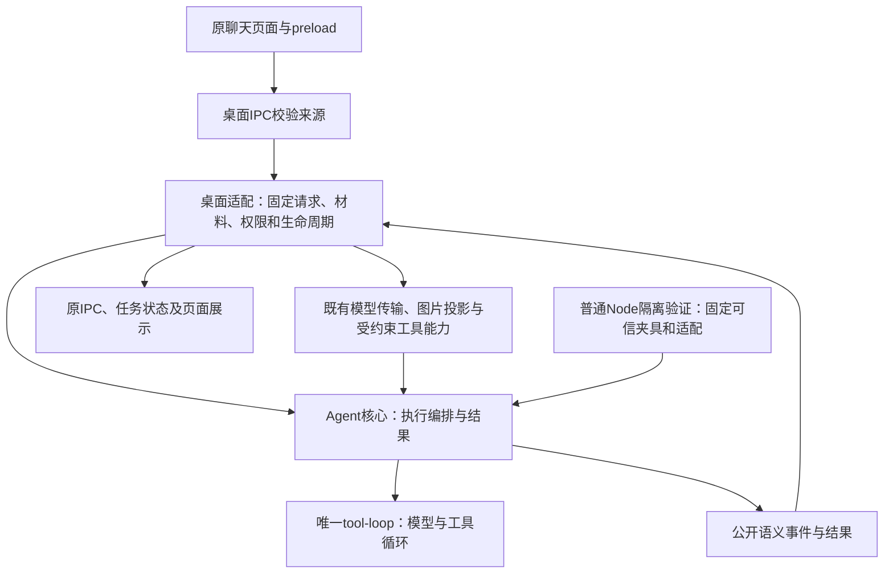
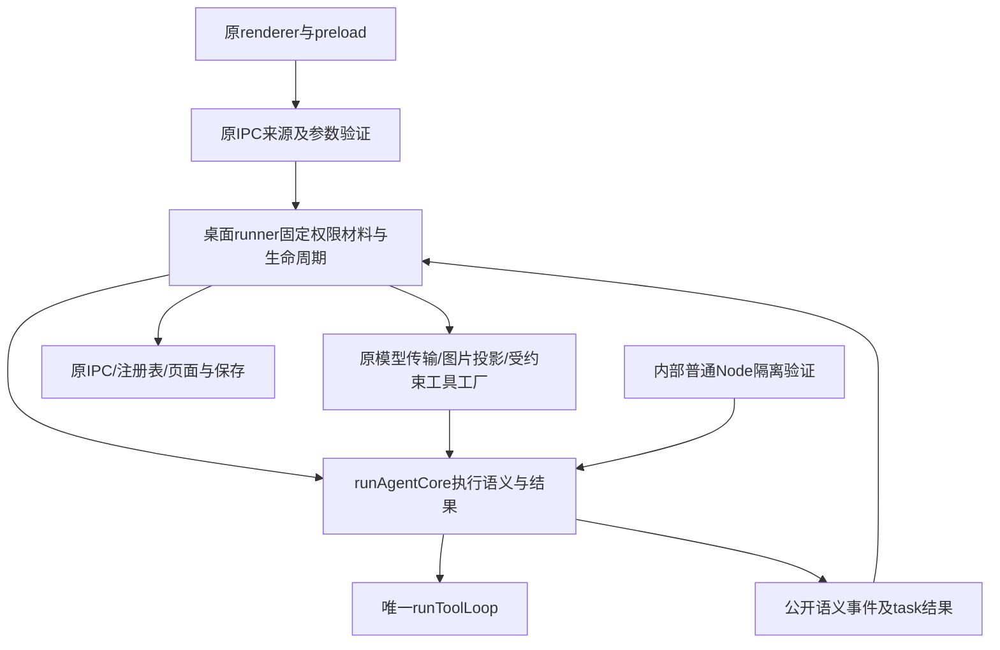

# 第五十四课：UI与Agent逻辑拆分

2026-10-10 第54课已完成实现与必要分层验收：普通Node可调用的Agent核心已接回原桌面入口，复用唯一工具循环；分层224项、原生IPC8组、renderer四组回归、Node/Web与开发/Windows目录包构建通过。双版真实默认gpt-6.1-sol价格主闭环和已有任务整进程重开零请求通过；合成/真实磁盘/原生IPC/联网结果分别记录。全部本轮失败与观测器EPERM诊断保留，修改后真实红测试再修正两版仍未覆盖，用户完整手工确认待补，八道自测待作答。第55课用户CLI、上下文整理与任务续接继续后置。 实际结果见[第54课实施记录](69-第五十四课-UI与Agent逻辑拆分.md#9-本轮实施与分层验收记录2026-10-10)；下方创建时和旧轮说明按原记录时间阅读。

创建日期：2026-10-10。状态：**课程已创建，产品实现与本课全部验收待进行；八道自测待作答。**本轮只编写课程和更新导航，没有拆分产品执行核心、运行模型业务任务或构建应用。

前置：[第53课任务验收基线](66-第五十三课-单Agent任务完成与验证闭环.md)、[第45～53课小结](67-第四十五至五十三课小结.md)及[第四次工程整理](68-第四次工程整理-消息展示职责分离与课程衔接.md)已完成相应工作。第53课双版价格主闭环和重开零请求有原证据；失败后继续业务修正仍未覆盖，手工任务的两次Agent测试来自用户报告，其应用版/model/requestId及手工重开未独立确认。第51/52课旧失败、第52课完整用户确认待补及各课自测保持。

## 1. 本课目标与前置条件

把已有Agent执行流程拆为**可独立调用的执行核心**和**Electron桌面适配层**，让聊天页面继续使用同一条工具循环，同时能在没有窗口、preload或页面的普通Node进程中调用实际核心进行受控验证。

完成后应能回答：本次固定请求从哪里来，谁验证权限和材料，核心怎样发模型请求及调用工具，公开事件怎样到页面，审批/提问怎样暂停恢复，停止与关闭由谁取消，终态和副作用风险由谁记录。

这里的“UI”包括桌面宿主与窗口适配，不只是React组件。第四次整理已经分开消息展示职责；本课不再次为行数拆消息组件或会话Hook。窗口来源、运行目录、权限版本、图片/附件身份及执行前复核继续是可信主进程的职责，不能在提取核心时删除。

本课保留现有真实默认`gpt-6.1-sol`、工作台、公开过程/工具/重试、文件查看、图片组/文本附件、设置、会话目录、三种授权、计划问答、存储及全部既有保护。第55课再提供用户可用的命令行/脚本入口；上下文整理与任务续接、MCP、Skills、SSH、并发和远程执行继续后置。

## 2. 用 Vue 经验理解本课

| Vue中的经验                           | 本项目对应                                   | 本课要分清的职责                             |
| ------------------------------------- | -------------------------------------------- | -------------------------------------------- |
| 组件或composable读取路由、DOM并发请求 | renderer会话/请求Hook与Electron runner       | 页面与窗口来源不能成为执行核心的必需参数     |
| service接收固定参数和回调             | 独立Agent核心与明确依赖接口                  | 输入是当前请求快照，不读取后来变化的页面状态 |
| 组件订阅事件并展示状态                | 桌面适配发布既有IPC，renderer按requestId更新 | 核心发布语义事件，宿主负责投递及身份隔离     |
| 后端校验登录权限，前端显示批准弹窗    | 主进程授权服务与批准界面                     | 改成回调不等于可以跳过权限与执行前复核       |
| AbortController贯穿一次请求           | 单次Agent任务取消信号                        | 模型、工具、退避及等待必须消费同一取消链     |
| service测试与页面端到端测试分开       | 普通Node核心验证、桌面回归及真实业务验收     | 一层通过不能代替其他层结果                   |

依赖注入在这里是把“怎样发送模型请求、怎样执行工具、怎样批准或回答问题、怎样投递事件”交给明确接口。它不要求新增通用框架、第二套工具循环或任意调用插件的总线。

## 3. 当前实际模块与拆分边界

以下按创建时源码核对，实施前需再次确认Git和调用方。链接均指向当前已有文件；后面的新模块名是建议，尚未创建。

| 当前文件                                                                                                                                                                                                  | 当前事实                                                                                       | 本课归属                                                        |
| --------------------------------------------------------------------------------------------------------------------------------------------------------------------------------------------------------- | ---------------------------------------------------------------------------------------------- | --------------------------------------------------------------- |
| [agent-ipc.ts](../src/main/agent/agent-ipc.ts)                                                                                                                                                            | `agent:start/cancel`校验IPC来源、请求参数和上下文，再调用runner                                | 桌面入口保留真实来源验证和取消归属                              |
| [agent-runner.ts](../src/main/agent/agent-runner.ts)                                                                                                                                                      | `runAgentRequest`接收windowId/WebContents，持有窗口jobs，捕获材料、审批/问答、发事件并更新任务 | 提取核心编排；窗口互斥、材料/权限及生命周期交由桌面适配         |
| [tool-loop.ts](../src/main/agent/tool-loop.ts)                                                                                                                                                            | 已有`SendResponse`、`ExecuteTool`及事件回调，仍由runner组合调用                                | 继续作为唯一模型/工具循环，由核心复用                           |
| [agent-tools.ts](../src/main/agent/agent-tools.ts)、[workspace-read-evidence.ts](../src/main/agent/workspace-read-evidence.ts)                                                                            | 工具分发、计划护栏及本执行请求可见行/hash凭据                                                  | 复用原实现；工具能力和凭据按请求创建，不由历史或页面补造        |
| [agent-instructions.ts](../src/main/agent/agent-instructions.ts)                                                                                                                                          | 构造本轮工具清单/指令，运行时导入提问工具schema                                                | 明确纯定义与宿主实现，核对间接Electron依赖                      |
| [agent-user-input.ts](../src/main/agent/agent-user-input.ts)                                                                                                                                              | 同时含工具定义与Electron窗口/主frame/请求关联的提问broker                                      | 必要时提取纯定义；桌面等待与回答IPC继续保留来源、取消和迟到保护 |
| [execution-context.ts](../src/main/execution/execution-context.ts)、[action-authorization.ts](../src/main/execution/action-authorization.ts)                                                              | 解析实际cwd/权限，复核本次上下文，处理三种批准策略                                             | 桌面捕获可信上下文并提供受约束能力；核心不自行查询窗口权限      |
| [task-registry.ts](../src/main/execution/task-registry.ts)、[app-runtime.ts](../src/main/app-runtime.ts)                                                                                                  | 窗口任务状态、关闭/刷新等清理及模块接线                                                        | 保持桌面任务归属与已有状态转换，不成为核心的直接依赖            |
| [image-access.ts](../src/main/project/image-access.ts)、[image-input.ts](../src/main/model/image-input.ts)、[attachment-access.ts](../src/main/project/attachment-access.ts)                              | 图片组及快照归属、实际资源投影、占用与释放                                                     | 可信捕获及释放留在适配层；发送依赖继续使用经验证的实际材料      |
| [workspace-actions.ts](../src/main/tools/workspace-actions.ts)、[command-plan.ts](../src/main/execution/command-plan.ts)、[command-runner.ts](../src/main/execution/command-runner.ts)                    | 精确补丁、单次授权执行计划及真实命令进程链                                                     | 复用现有保护，不为无窗口验证开直通执行旁路                      |
| [useChatRequest.ts](../src/renderer/src/features/chat/useChatRequest.ts)、[useConversation.ts](../src/renderer/src/features/conversation/useConversation.ts)、[agent-api.ts](../src/preload/agent-api.ts) | 请求身份、唯一会话状态、迟到隔离、保存及受限桥接                                               | 保持当前公开契约，消费桌面适配后的原事件                        |

已有`tool-loop.ts`回调不代表整条执行链已独立。一个具体隐式依赖是`agent-instructions.ts`运行时导入`agent-user-input.ts`的`requestUserInputTool`，后者顶层导入Electron。工具定义和真实工具后端也可能引入宿主依赖；不能只搜索新核心文件中的`electron`字符串。

另一条实际链是指令/工具工厂经`workspace-actions → command-runner → command-plan → windows-command-backend`加载Windows宿主后端。该后端本身没有Electron导入，也不在模块顶层启动命令，但资源定位使用`process.resourcesPath/defaultApp`及`__dirname`，准备计划时才核查后端/监督器。最小方案可以让桌面适配继续持有`buildAgentRequest/createLiveResponse/createAgentToolExecutor`，核心只接已构建发送/执行能力，避免全链抽象。`ExecutionContext`、`CapturedImage`的既有type import不因此算运行时Electron耦合。

建议新增`main/agent/agent-core.ts`及必要的`agent-core-contract.ts`，将原`agent-runner.ts`保留为桌面协调入口或委托给小型桌面适配模块。按实际依赖选择最少模块；仅有当前需求的纯定义/接口才提取，不把所有工具、授权和存储重新设计一遍。

目标调用关系如下，新核心及接口在本课实施时建立：



普通Node验证入口只用于本课内部核验，不是第55课用户CLI。核心运行时导入闭包应不需要Electron、BrowserWindow/WebContents、window.api、页面DOM或窗口注册表；实际宿主依赖通过适配接口注入。

## 4. 按依赖顺序安排练习

### 步骤一：固定拆分前基线与责任表

读取本课、编写约定、结构地图、进度、第四次整理以及第53课合同和第52课后续调整。核对Git未提交改动、HEAD、当前源码/产物，另建本课UUID证据和原字节快照。原第53课是业务合同来源，不能把它的旧源码hash、模型请求数或目录包产物当作本轮新结果。

列出runner中的准备、执行和收尾：窗口互斥、请求快照、权限/材料捕获、历史校验、模型/工具组合、公开事件、审批/提问、任务转换、失败副作用提示、取消和资源释放。记录每项唯一拥有者及调用方；按受影响范围固定组件与安全回归，必要时用当前构建的新UUID建立拆分前真实主任务样本。

**预期效果：**每个职责有去处，拆分前保护合同已经固定。**常见错误：**从移动文件开始；抄旧版本runner；为缩短行数制造第二套状态；沿用旧包或旧统计声称本课通过。

### 步骤二：定义固定输入与明确依赖接口

核心接收本次已验证的数据快照、请求相关ID和取消信号。模式、提示词、历史、scope、执行信息及材料投影在本次开始时固定；对数据按现有规则校验和复制，不把可变renderer状态、窗口对象或任意未验证路径直接塞入核心。

按当前`SendResponse`、`ExecuteTool`及事件类型定义必要依赖。可以由可信桌面适配先生成本轮模型发送函数及工具执行器，再交给核心；审批、问答、上下文复核及副作用通知通过明确回调闭合。也可提取必要纯工具定义，使核心组合纯逻辑。最终选择以普通Node实际加载和现有保护保持为准，不能把一个含windowId/sender的“大context对象”改名为port就算完成。

输入与事件接口不引用Electron类型；类型导入与运行时依赖分开检查。`requestId`、`conversationId`等业务关联可以保留，窗口和页面拥有者由宿主记录。缺失需要的批准/回答能力要明确失败或取消，不能默认批准、默认回答或暗中退回窗口全局对象。

**预期效果：**核心参数能在普通Node进程中构造，可信来源仍由宿主建立。**常见错误：**仅去掉类型注释而保留Electron全局；把任意调用者的permission字段视为真实授权；用默认允许回调让测试过关。

### 步骤三：提取执行编排并保持唯一工具循环

将已准备请求的执行、公开记录/重试归并、失败或取消结果、trace/耗时及副作用风险语义提取到核心或明确纯辅助模块，继续调用原`runToolLoop`。本课不新增一套Responses客户端、工具循环、完成评分器或自动续接。

保留round/attempt消息身份、失败commentary退休、可信中断片段、实际工具记录、成功工具不重放和原副作用风险提示。只公开commentary、真实工具和最终回答；私有推理/加密协议继续仅沿原协议链保存及发送，不作为可见“思考”。任务`completed`表示循环终态，不代替固定业务测试通过。

`WorkspaceReadEvidence`仍属于每次实际执行请求：计划/附件/历史不能提供补丁凭据，读取完成并复核后才登记实际完整可见行；同hash合并、异hash替换、成功补丁后失效，不能因核心可复用就跨任务共享。计划护栏应在调用批准、命令或写入之前执行，不只靠提示词。

**预期效果：**核心拥有执行语义，同一执行器继续提供现有工具保护。**常见错误：**只把runToolLoop包一层却把全部编排留给桌面；为测试另写工具循环；取消后将已有副作用标记抹掉；让core单例共享读取凭据。

### 步骤四：接回桌面适配与原页面

保留IPC来源/参数校验、窗口jobs互斥、请求与任务关联。桌面适配负责实际目录、权限版本、AGENTS.md、工作区、快照和图片组捕获及后续复核；图片当前/历史归属和实际图片发送继续保持，不能用图片描述文本替代原图。

适配层将核心语义事件转换为现有`agent:progress`、`model-stream:delta`、`agent:tool-event`、`agent:message-event`及`agent:retry`。投递前核对当前请求、取消和页面存活；不得向新会话或刷新后的页面投递旧结果。任务注册表仍由桌面维护，等待批准/回答和终态按原允许转换；原命令提案等待批准分支不能一律改成completed。

三种授权继续沿`action-authorization`和单次命令计划处理，批准绑定具体操作/目录/权限版本，执行前二次复核；计划答复不能当执行批准。提问继续绑定原窗口、主frame、requestId/callId和inputId，旧、重复或迟到答案拒绝，取消与来源失效必须解除等待。切换工作方式本身仍为0模型请求，必须明确发送才执行。

文件批准与命令执行计划保持区别：`WorkspaceApprove`不是通用命令批准，命令沿`CommandAuthorize`取得原`CommandExecutionPlan`。该计划通过WeakMap绑定真实准备/签署对象并只消费一次，启动前再复核程序、目录、Git指向、保护路径和后端；不能把它简化为boolean或能由任意JSON重建的授权票据。

**预期效果：**用户看到原界面和交互，调用链多出明确核心边界。**常见错误：**为了接口统一删除来源校验；假设回调成功就不用再核对权限；将回答问题等同写入授权；给renderer直接暴露任意核心调用。

### 步骤五：收口取消、错误与资源释放

明确外层任务取消信号的拥有者。主动停止、窗口关闭/刷新/崩溃、材料撤销或上下文失效继续取消模型、工具、退避、批准与提问等待；核心消费同一取消链，不新增脱离窗口生命周期的后台任务。按原规则提交结果、失败或取消状态，命令提案仍可待批准，准备失败也可能尚未创建任务；再按原归属释放本次jobs、监听、等待和图片占用，不能重复完成或清掉另一请求。

保留批准/副作用风险标记及“先核对文件或命令结果”的失败提示。命令进程树退出未确认仍如实记录，不记成功；不能因适配失败自动放宽权限、普通方式重跑或重放整轮。资源释放既验证成功，也验证准备失败、模型错误、等待中取消及核心/宿主异常。

**预期效果：**结束后没有遗留等待、监听或进程，新请求保持独立。**常见错误：**只测成功路径；core结束后旧回调仍投递；关闭窗口却继续运行；将整任务4分钟总时限重新写回。

### 步骤六：普通Node验证与受影响桌面回归

在普通Node进程中实际导入编译后的核心并运行，不启动Electron、不创建BrowserWindow、不依靠`ELECTRON_RUN_AS_NODE`掩盖Electron依赖。检查可达运行时导入，必要时对Electron导入设置拒绝桩；单纯类型检查、grep或测试mock整个核心都不足以证明独立。

使用实际核心/原tool-loop及预先固定的模型传输、工具/授权/问答适配夹具，检查多轮执行、计划禁止操作、回答暂停恢复、自动重试不重放、取消/迟到、非零命令返回、错误与副作用风险、读取凭据和容量。涉及真实文件保护时用隔离自制文件与原工具链，不以替身“success”冒充真实磁盘修改。

合成`ExecuteTool`只证明核心编排及回调语义。计划护栏、读取凭据及补丁保护须另接原`createAgentToolExecutor/WorkspaceReadEvidence`与必要实际工具实现，用隔离文件验证；替身自行返回“已拒绝”或“修改成功”不能证明这些保护成立。

另测实际桌面入口/适配的来源、请求/权限版本、旧批准/迟到答案、关闭刷新和等待释放。复用第四次整理消息展示及原模式/重试/图片/存储等受影响检查，输出新UUID证据，不覆盖旧测试结果。注明哪些使用真实React/Electron、真实IPC/文件/进程，哪些使用模型或API替身。

**预期效果：**独立核心能运行，桌面保护没有绕路。**常见错误：**把真实业务过程全换为合成success；在Electron中跑测试却称普通Node；只测新核心不测适配；替身注入失败写成真实网络或业务失败修正。

### 步骤七：开发版与Windows目录包真实任务回归

完成必要Node/Web、定向lint/格式、开发构建和`build:unpack`，确认当前out、原exe/ASAR及Windows命令资源对应本轮源码。两版各使用新UUID数据和第53课自制价格合同的新项目副本，测试、需求、旁路文件及package在模型开始前固定并保护；不能复用已经修好的旧项目。

保持真实默认`gpt-6.1-sol`，计划先研究并保持业务原字节不变，再明确切执行并发送。每个完整业务任务在同一次execute requestId内由Agent实际按需读取、精确补丁、运行原固定8项测试、重读修改并再次运行同一测试完成。独立检查实际diff、受保护文件hash、未改正文、BOM/换行/尾换行、备份和真实退出码，不固定模型措辞、工具顺序或旧9工具/10轮等观察数字。

保存退出后整进程重开，至少观察5秒：主模型、标题、审批请求及Agent/命令启动全部为0；历史正常恢复而不恢复循环、批准、待答或读凭据。两版分别记录主任务、标题/审批、重开及真实失败，不能从空库启动0请求推断已有任务重开通过。

若自然出现已修改业务后的红测试，检查同一执行请求内继续修正/重验并如实记录；一次修对就记录主任务成功及失败修正未覆盖，不制造错误补丁、假模型/工具返回或无限抽样。历史第53课未覆盖分支不由本课普通Node合成失败替代。

**预期效果：**分离后同样完成真实业务和重开保护。**常见错误：**验收器代替Agent测试；修改测试或复用旧修好项目；在原包入口上注入合成模型却称真实；只记HTTP200而未核对流完成；借旧课结果填本课表。

## 5. 验收条件与方法

本课创建时下表**全部待验收**。实施完成、各层通过、用户实测和自测掌握分别记录，不把创建课稿记为核心已实现。

| 层级           | 必须核对的结果                                                                      | 创建时状态                   |
| -------------- | ----------------------------------------------------------------------------------- | ---------------------------- |
| 职责/依赖      | 固定输入与明确能力边界；核心可达运行时导入不需要Electron/页面；唯一tool-loop        | 待验收                       |
| 普通Node核心   | 实际核心配受控适配完成多轮、计划、问答、重试、取消/迟到、错误/副作用及必要保护      | 待验收，合成与真实文件层分记 |
| 桌面适配       | 真实入口来源、请求/权限/材料复核、三策略、等待取消、旧批准/晚答案拒绝与生命周期保持 | 待验收                       |
| renderer/保存  | 消息展示、计时/重试/折叠焦点、模式/问答、图片/附件、设置/目录和历史恢复保持         | 待验收，按受影响范围复用     |
| 静态/交付      | Node/Web、必要lint/格式、开发构建、Windows目录包及资源对应                          | 待验收                       |
| 双版真实主任务 | 固定价格合同；每版单execute、Agent两次实际8项测试、独立diff/hash/格式/备份核验      | 待验收，真实默认模型         |
| 双版整进程重开 | 已保存任务重开至少5秒，全部模型请求及Agent/命令启动0，不恢复等待或凭据              | 待验收                       |
| 真实失败修正   | 修改后真实红测试→同execute继续业务修正→同固定测试通过                               | 待观察；未触发就记未覆盖     |
| 历史/文档      | 当前基线、新UUID证据、复跑入口及实际失败完整；旧51/52/53失败和自测保持              | 待验收                       |

固定保护：会话版本9、设置版本1、统一`images`与合法`imageHistory`；本轮协议160项及完整模型输入128000字符、输出/图片/参数预算；局部补丁原字节及最终候选各128 KiB、6000字符patch、实际可见行/hash、唯一上下文、格式/备份/冲突/取消/读回；单次命令及审批/准备局部期限保持。固定8工具/9轮、整任务4分钟、跨轮300项/64000字符及历史图片索引小于300均已取消，不恢复。详情沿第52课当前第10～15节及源码核对，不能写成无限输入或无限单命令。

Windows沙箱完整OS隔离仍有历史未通过范围，本课不能因核心独立或打包通过而改写。真实主任务可沿第53课完全访问的明确授权基线，其他授权和错误路径按自己的实际层级验证；完全访问也不能绕过计划或来源/取消复核。

## 6. 八道自测题

状态：**八题均待作答，不附参考答案。**

1. 为什么已有`runToolLoop`回调和第四次消息组件拆分，仍不能证明Agent核心已经与窗口分离？
2. 固定请求快照应该包含什么，窗口、权限和图片/附件真实性应该由谁建立及后续复核？
3. 一个工具schema为何可能间接引入Electron？类型导入、运行时导入与普通Node实际验证有什么区别？
4. 公开语义事件怎样回到原renderer？怎样保留requestId、round/attempt及迟到结果隔离？
5. 审批和计划提问各自如何暂停恢复？缺少适配或收到旧答案时为什么不能默认继续执行？
6. 单次执行请求的可见行/hash凭据、五次模型重试及已执行工具不重放怎样随拆分保持？
7. 在等待批准、退避或已发生副作用时停止/关窗，核心和桌面分别应怎样取消、记录和释放？
8. 普通Node合成核心检查、真实桌面适配检查、双版真实业务和重开验收各证明什么？第55课还需做什么？

## 7. 学习记录与下一步

本轮已创建课程、核对当前调用链并更新导航；产品实现、本课模型/工具验收和双构建均未执行，表中状态保持待进行。当前Git开始时干净，HEAD为`de4ccd1745f3c249c20b064fbbb951ba40cc9e60`，与第四次整理创建时HEAD不同，不能套用前轮保护基线。

本轮只记录课程文档检查：格式、链接/标题、原文保留及非修改文件hash；结果保存在`.ui-check/lesson54-create/6b5d0935-480a-486e-8b1a-b6f3403c05cf/`。检查通过不代表独立核心、真实业务或用户自测已通过。

创建阶段实际核验：74份项目/课程文档本地链接与标题检查通过，278/278非修改范围文件hash保持，十份原文档的原字节行按序保留，Git HEAD及改动范围保持；自测题数8、待实施状态核对通过。两次独立只读审查核对了现有依赖、命令计划、材料、取消与本课/第55课边界；修正“结果先终态化”的措辞，明确命令提案可待批准、准备失败可未建任务，并补明合成工具回调不能证明计划/读取凭据保护。

文档核验器准备曾因内联引号生成失败、随后脚本缺失，以及首版变量作用域错误而未完成检查；只修本轮新核验器，原失败说明与首版保留在[准备失败记录](../.ui-check/lesson54-create/6b5d0935-480a-486e-8b1a-b6f3403c05cf/initial-validator-preparation-failure.json)。修正后[首次通过结果](../.ui-check/lesson54-create/6b5d0935-480a-486e-8b1a-b6f3403c05cf/validation-aded7d93-61d8-4914-bda7-2210161a385c/results.json)另存UUID；这些是文档检查问题，不是产品或模型验收失败。本轮产品修改、模型请求、业务测试和构建均为0。

复查：项目根运行`node .ui-check/lesson54-create/6b5d0935-480a-486e-8b1a-b6f3403c05cf/verify.mjs`，每次新增`validation-UUID/results.json`，不覆盖旧结果。后续实施改变源码时需建立本课实施新基线，不能继续要求所有产品文件等于本次创建hash。

实施后在本节追加实际迁移表、最终调用链、逐层结果、失败/未覆盖、用户确认与复跑方法；同步进度、路线、结构地图、编写约定及相关索引。只有真实满足第5节相应范围才记通过。

第55课在本课核心及桌面回归建立后，再增加用户命令行/脚本适配，明确输入、事件、批准、提问、停止和退出结果。本课普通Node内部测试不提前算第55课完成；上下文整理与任务续接继续后置。

## 8. 可复制到新对话的完整实施指令

以下文本供后续明确实施第54课时使用；**本轮创建课程不执行其中的产品与验收动作。**

```text
开始完成第54课：UI与Agent逻辑拆分。
项目目录：D:\AiTools\ZoneCodex\ZoneCodex
先读取：
D:\AiTools\ZoneCodex\ZoneCodex\ZoneCodex学习计划\69-第五十四课-UI与Agent逻辑拆分.md
按本课第4/5节及本节完整实施。按需读取编写约定、结构地图、进度、第四次工程整理、第53课固定任务合同/实际失败和第52课第10～15节，核对当前源码与Git未提交改动。课程已经创建，本次直接完成必要实现与验收，不停留在计划。

先建立本轮当前源码、产物、固定行为与业务合同的基线，使用新UUID和原字节快照，保留已有未提交改动。第四次整理只分了消息展示，当前runner仍直接依赖windowId/WebContents、窗口材料/权限、审批/提问、事件与生命周期；这些是本课具体拆分边界。

提取能在普通Node中实际导入/调用的Agent执行核心，复用唯一runToolLoop、现有模型传输与受约束工具链；固定请求、取消信号、公开语义事件及结果通过明确接口传入/传出。不能只改文件名、包装现有loop或把含窗口对象的大context改名为port。核对核心可达运行时依赖，特别是agent-instructions运行时引用提问schema而导入Electron broker的隐式链；必要时只拆纯定义，或由可信宿主注入已组合SendResponse/ExecuteTool与必要能力，避免引入窗口后端。

Electron适配继续验证IPC来源/主页面、窗口与request/task/conversation归属、固定模式、目录/权限版本、AGENTS.md、图片组/历史图片及附件来源，捕获后和执行前按原规则复核。保持窗口互斥、原公开IPC/API及唯一会话状态；公开事件投递继续隔离取消、刷新和旧请求。授权仍走三种原策略及单次命令计划，计划问答不授予执行权限；缺失能力不默认批准/回答。待批准/待答、旧/重复/迟到结果及关闭刷新崩溃的等待释放保持。

保持默认gpt-6.1-sol、完整已有界面、材料、设置、目录、存储、公开过程/工具/计时/重试/折叠/焦点/文件查看。保留五次模型自动重试、冻结请求、成功工具不重放、副作用先核对及失败/取消真实记录。可见行/hash凭据属于同一次实际执行请求，计划/历史/附件不提供补丁凭据，成功补丁后失效；保留精确唯一局部补丁、原字节/候选各128KiB、BOM/换行/尾换行、备份/冲突/取消/读回与原授权。

不恢复已取消的固定8工具/9轮、整任务4分钟、跨轮300项/64000字符或历史图片索引<300；保留本轮160项、完整输入128000字符、图片/输出/参数和单操作期限。未发布项目按唯一当前结构处理，不恢复旧版本兼容链；本课原则上保持现有公开契约和存储版本，确有必要调整要记录具体依据，不自动清空或迁移用户记录。

按第5节逐层验收：普通Node实际核心与运行时依赖；实际核心/原loop配固定合成适配的取消、迟到、计划、问答、重试、不重放、错误/副作用及必要保护；真实桌面适配来源/授权/材料/生命周期；受影响renderer/保存回归；Node/Web、必要lint/格式、开发构建与Windows目录包及当前产物对应。模型/API替身、真实React/Electron、真实IPC/磁盘/进程和真实联网结果分开记，使用新证据目录，不覆写旧失败。

合成ExecuteTool仅用于编排/回调验收；计划护栏、同请求可见行/hash凭据及补丁保护须连接原createAgentToolExecutor/WorkspaceReadEvidence和必要原工具链，用隔离文件验证，不能由替身自称拒绝或成功来证明保护。

用隔离数据、自制价格业务项目和模型开始前固定的受保护8项测试完成开发版及原Windows目录包真实默认模型回归。不要复用已修好的旧项目，不让模型改测试、需求、旁路或package。每个完整任务在同一次明确execute requestId内由Agent真实读取/局部补丁/实际测试、重读并复测完成；独立核对diff、测试hash、业务结果、未改正文、原格式和备份。整进程重开后至少观察5秒，主模型/标题/审批请求及Agent/命令启动全部为0。HTTP200、completed、空库启动或旧课统计不能代替此项。

已修改后的真实红测试若自然发生，核对同一execute内继续修正与重验；未发生就如实记未覆盖，不造模型/工具结果、不故意误修或无限重跑，不用初始红测试/传输重试/合成失败冒充业务失败修正。第51/52课旧失败、第53课全部原尝试和手工来源边界保留，不因本课成功改写。

完成后更新本课实际文件迁移、调用链、课程/进度/结构地图/路线/编写约定和相关索引，记录各层实际结果、失败、未通过/未覆盖、证据和新UUID复跑方法。保留所有未提交改动，不提交或重置Git，不清空用户库、工作目录或旧证据，八道自测保持待作答。第55课用户CLI及上下文整理/任务续接继续后置；本课仅用内部普通Node验证入口，不提前提供另一套用户执行入口。
```

## 9. 本轮实施与分层验收记录（2026-10-10）

2026-10-10 第54课已完成实现与必要分层验收：普通Node可调用的Agent核心已接回原桌面入口，复用唯一工具循环；分层224项、原生IPC8组、renderer四组回归、Node/Web与开发/Windows目录包构建通过。双版真实默认gpt-6.1-sol价格主闭环和已有任务整进程重开零请求通过；合成/真实磁盘/原生IPC/联网结果分别记录。全部本轮失败与观测器EPERM诊断保留，修改后真实红测试再修正两版仍未覆盖，用户完整手工确认待补，八道自测待作答。第55课用户CLI、上下文整理与任务续接继续后置。

本课第1～8节保留创建时原文和待实施状态，当前实际结果以本节为准；第6节八题原文及待作答状态不变。当前实施HEAD仍为de4ccd1745f3c249c20b064fbbb951ba40cc9e60。开始时已有10份文档修改及本课未跟踪课稿，全部保留；另保存289份原文件字节与366份当时out/目录包产物hash，见[实施基线](../.ui-check/lesson54/implementation-9e93f9d5-46cc-466b-a84a-3943ce7f93e1/baseline.json)和[责任表](../.ui-check/lesson54/implementation-9e93f9d5-46cc-466b-a84a-3943ce7f93e1/responsibilities.md)。

### 实际迁移与调用关系

| 原职责                                                                   | 当前文件                                                           | 唯一拥有者                                 |
| ------------------------------------------------------------------------ | ------------------------------------------------------------------ | ------------------------------------------ |
| runner中的执行编排、公开记录/重试退休、可信中断片段、终态及副作用风险    | [agent-core.ts](../src/main/agent/agent-core.ts)                   | 每次runAgentCore调用，不持有窗口注册表     |
| 固定输入、受约束能力、公开语义事件与结果接口                             | [agent-core-contract.ts](../src/main/agent/agent-core-contract.ts) | 纯数据与type接口，不授予目录/文件/命令权限 |
| 窗口互斥、可信准备、材料/权限复核、审批/问答、任务状态、IPC及finally释放 | [agent-runner.ts](../src/main/agent/agent-runner.ts)               | 原Electron桌面适配                         |
| 模型/工具循环、计划隐藏工具护栏、容量、call_id防重                       | [tool-loop.ts](../src/main/agent/tool-loop.ts)                     | 原唯一实现，原字节保持                     |

`runAgentCore(input, dependencies)`接固定requestId/conversationId、mode、prompt、history、scope与imageHistory，在首次await前校验、复制。实际cwd/权限/AGENTS与图片/附件投影由可信宿主组合的send/createTools持有；scope只是工具描述，不是任意调用者的授权。signal由宿主拥有，assertCurrent/send/createTools显式提供；缺能力明确失败，缺问答后端不默认回答，批准继续沿原三策略与真实单次命令计划。

核心承担公开progress/delta/tool/message/retry、round/attempt归并、失败commentary退休、实际工具记录、可信失败/取消片段、批准/副作用风险、trace与耗时，返回result/task/effects/elapsedMs。原命令提案仍是waiting_approval，completed只表示循环终态。每次createTools构造原请求级执行器与WorkspaceReadEvidence；计划、历史、附件不提供当前补丁凭据。

桌面继续捕获实际目录/权限revision、AGENTS指纹、附件快照、当前/历史图片组及占用，执行前按原规则复核。事件映射原五种IPC，投递前增加当前job、取消、sender存活及原主frame门控；审批/问答来源和waiting转换仍在原broker/注册表。关窗/刷新/崩溃/停止/材料撤销沿同一signal取消；核心终态后回调失效，取消竞争中已经真实返回的工具结果仍保存。finally按原归属释放pins、监听与job，准备失败尚未进入core时由桌面收尾。

核心运行时闭包实际为11模块，只到core/loop、纯shared、errors与current-time；普通Node实际导入编译核心时Electron尝试0，没有window/document或ELECTRON_RUN_AS_NODE。contract的SendResponse等type import擦除；原agent-instructions导入桌面问答schema的链继续在宿主，最小拆分无需另改纯schema或全部工具定义。耗时仍使用原宿主performance起点包含准备，但记录点移至core返回前，不计最后同步任务映射/资源释放；不恢复整任务deadline。



### 分层结果与实际边界

| 层级                        | 本轮结果                                                                             | 证据与限制                                                                                                                                                                                                                                                                                                                                                              |
| --------------------------- | ------------------------------------------------------------------------------------ | ----------------------------------------------------------------------------------------------------------------------------------------------------------------------------------------------------------------------------------------------------------------------------------------------------------------------------------------------------------------------- |
| 职责/运行时依赖             | AST/保护核对39项通过，核心11模块无Electron                                           | [源码审查](../.ui-check/lesson54/implementation-9e93f9d5-46cc-466b-a84a-3943ce7f93e1/review-44076db4-47fa-46f7-ac59-de5812a26016/runs/8a3b5572-3982-4c91-88e2-6047ea83335a/review.json)；原16份执行/工具/模型/材料保护文件字节保持                                                                                                                                      |
| 普通Node核心                | 23/23，12工具/13轮、快照、计划/问答、五次重试不重放、取消/迟到、非零结果、风险与容量 | [分层总汇](../.ui-check/lesson54/layered-checks-955e0f25-209a-4446-9e62-fd21438023b0/layered-summary.json)；模型/HTTP多数为固定替身，3项连接实际core+原工具/真实隔离磁盘                                                                                                                                                                                                |
| 原工具与读取/补丁保护       | 86项，容量10项，128KiB/提交恢复45项                                                  | 实际读取、凭据、补丁、备份与读回；审批/模型及特定CommitIO竞态替身，不能当OS隔离验证                                                                                                                                                                                                                                                                                     |
| 桌面来源/等待/材料/命令计划 | 问答11、runner18、材料18、命令计划13；以上合计8组224/224                             | 原模块与真实隔离文件/图片字节；Electron窗口/frame/IPC传输、解码、后端/监督器明确替身，命令计划13项不启动进程                                                                                                                                                                                                                                                            |
| 原生IPC                     | 开发版原入口与原handler8组通过，5015ms无模型/实际任务/命令，正常退出0                | [原生结果](../.ui-check/lesson54/implementation-9e93f9d5-46cc-466b-a84a-3943ce7f93e1/native-ipc-892f7df9-ad31-4857-8115-be7a8e6fdfbd/run-8e3fe7ff-222c-4872-9c4b-a46d8ee27a48/summary.json)；无效agent:start显式调用4次，不能写入口调用0；额外子frame探针5类来源拒绝，探针特权配置不代表原窗口子frame安全设置验收                                                       |
| renderer/保存               | 消息46、文件31、重试/计划卡42、折叠/焦点12全过                                       | [消息/文件与首失败说明](../.ui-check/lesson54/renderer-fc1eb3d9-6acf-4c62-be03-9442a5accdd5/provenance-and-failures.json)；[42项](../.ui-check/lesson54/retry-renderer-fc2b8d7a-fdb7-4861-81dc-806d2fb13865/results.json)；[12项](../.ui-check/lesson54/activity-977fe56b-52c5-49dd-8d0d-d656e630297a/ui-comparison.json)；实际React/Electron，API/模型/展示props为夹具 |
| 静态/交付                   | Node/Web、三文件lint/格式、开发构建及build:unpack通过                                | [构建日志](../.ui-check/lesson54/build-6251c6b0-402e-4a4b-8c8a-4d0ba6e0cea9/build-unpack-outside-sandbox.log)；208份构建输入不变，5份out/ASAR及7份runtime资源对应                                                                                                                                                                                                       |
| 双版真实业务/已有任务重开   | 两版固定price主任务、Agent两次真实8项测试、独立diff/hash/格式/备份和整进程重开通过   | [完整真实汇总](../.ui-check/lesson54/real-summary-dcac121a-c8bd-4a50-b576-656a37f2381b/summary.json)；真实默认gpt-6.1-sol，与上述合成结果分开                                                                                                                                                                                                                           |
| 真实失败修正                | 两版修改后红测试再修正均未覆盖                                                       | 一次修对如实记录，初始红测试、观测器失败和合成异常不替代此项                                                                                                                                                                                                                                                                                                            |

ASAR SHA-256为7305ad23ac6b6bde66b5145b7f8a255c029127ba976ee936081f1e230c52a8d2，exe为94293628a7e3bbbaa27e993b394c6be9bb089571a3015ce539fe0cc09aaa3c33。只对应本轮最终产物；原第51/52/53课失败、手工来源边界及Windows沙箱完整OS隔离未通过范围不改写。

### 双版真实任务与独立核验

每版新UUID价格项目，模型开始前固定并保护test.mjs、requirements.txt、sidecar.txt和package.json；计划仅研究且原业务字节不变，切模式本身0请求，再一次明确execute。Agent在同一次requestId按需重读/精确局部patch，实际运行原8项测试、重读改动并复跑同一测试；原工具返回exitCode0与treeExited=true。验收器额外运行固定测试仅用于独立核验，不替代Agent两次测试。

| 版本            | execute requestId                    | 实际执行观察               | 全任务主模型/标题/审批 | 结果                                             | 原证据                                                                                                                                                                  |
| --------------- | ------------------------------------ | -------------------------- | ---------------------- | ------------------------------------------------ | ----------------------------------------------------------------------------------------------------------------------------------------------------------------------- |
| 开发版          | b90fe367-dafa-44b3-a96f-fc63d7cc68d1 | 9工具 / 10完成轮 / 10尝试  | 17/17；标题1/1；审批0  | Agent两次固定8项测试全过，独立核验与5秒重开0通过 | [real-task-development-price-d93e1cd6-2254-4996-9995-b7f1078f4c61](../.ui-check/lesson54/real-task-development-price-d93e1cd6-2254-4996-9995-b7f1078f4c61/results.json) |
| 原Windows目录包 | 7f4c6d13-6d36-416f-89d0-ef5240364c54 | 11工具 / 12完成轮 / 12尝试 | 19/19；标题1/1；审批0  | Agent两次固定8项测试全过，独立核验与5秒重开0通过 | [real-task-packaged-price-4ae78527-9d4c-4b68-9265-c7bf857153d4](../.ui-check/lesson54/real-task-packaged-price-4ae78527-9d4c-4b68-9265-c7bf857153d4/results.json)       |

开发版初始89662字节→89664字节，仅两处计算修改；实际可见41/501行，未要求累计完整读完；最终hash 177478b50f448f496dc7bde2dceb266590ffbb6c2b4d0f68012530549a7aed1c。

目录包初始89662字节→89664字节，仅两处计算修改；实际可见42/501行，未要求累计完整读完；最终hash 177478b50f448f496dc7bde2dceb266590ffbb6c2b4d0f68012530549a7aed1c。

独立diff确认小计由加法改乘法、basis-point折扣分母100改10000；业务范围外正文、四保护文件hash、UTF-8 BOM、CRLF、三个尾换行及至少一份等于初始的实际备份保持。真实模型收到原工具输出，未替换响应/工具/退出码。每版561份源码/runtime/out/包产物hash在任务前后保持。

保存后关闭原进程exit0、关闭调试连接，再以新PID/同隔离userData整进程重开；从首入口暂停装透明观测器捕获启动请求，至少观察5秒，主/标题/审批/其他fetch以及Agent、命令、spawn全部0，没有复活批准/提问/运行任务或当前读凭据；会话版本9、历史、模式及目录恢复。重新选择工作区/授权复位属于原保护。

真实任务的requirements附件选择位于.ui-check隐藏路径，被原附件路径保护拒绝；Agent沿原工作区工具实际读取需求，业务仍通过。本轮price不能声称正向附件选择或多图原生手势联机通过，正向附件/图片字节投影来自单列材料夹具检查，不改隐藏路径保护或抹掉原警告。

### 全部失败与未覆盖

本轮所有真实尝试都进入显式目录列表，不只汇总成功轮。以下原失败不覆写：

| 尝试                                                             | 主完成/尝试；标题；审批 | 本地影响                           | 证据                                                                                                          |
| ---------------------------------------------------------------- | ----------------------- | ---------------------------------- | ------------------------------------------------------------------------------------------------------------- |
| real-task-development-price-8fcbda7b-1888-4fed-b570-6340111499a0 | 6/7；标题1/1；审批0     | 未进入execute，原字节保持是，备份0 | [原失败](../.ui-check/lesson54/real-task-development-price-8fcbda7b-1888-4fed-b570-6340111499a0/results.json) |
| real-task-development-price-07e3ad1c-b0d8-4d72-b81e-c8c671989ebc | 6/7；标题1/1；审批0     | 未进入execute，原字节保持是，备份0 | [原失败](../.ui-check/lesson54/real-task-development-price-07e3ad1c-b0d8-4d72-b81e-c8c671989ebc/results.json) |
| real-task-development-price-2e2f8ce1-99bd-42ff-9d6e-059478a11ad6 | 0/0；标题0/0；审批0     | 未进入execute，原字节保持是，备份0 | [原失败](../.ui-check/lesson54/real-task-development-price-2e2f8ce1-99bd-42ff-9d6e-059478a11ad6/results.json) |

最初两次开发计划均在最终文字流HTTP200后未见response.completed而UI/runner失败，尚未execute、命令/备份0，原业务与四保护文件不变。第二次诊断eof=false、无reader错误/服务端失败事件，不能直接称网络EOF。后续有效诊断实际捕获观测器save重命名audit.json.next→audit.json的Windows EPERM；改为显式备用异常记录且不向产品抛错，并由终态观测IPC取得完整内存audit再独立落盘核对，真实任务得以完成。前两轮没有原始异常栈，只记此关联线索，不断言旧两轮唯一根因；应用源码、模型、合同与测试未因此修改。

其他失败按层保留：首次目录包打包网络EACCES（其Node/Web与开发build已通过），沙箱外完整build:unpack复跑通过；renderer在受限环境两次55秒启动超时，未进入progress，原日志保留，沙箱外新UUID同合同42项通过；核心夹具4项与bundle类身份1项、附件隐藏路径2项与遗漏allowUpload1项、AST首轮4项误报/目录准备失败、原生IPC三轮长路径/子frame桥/预期拒绝日志误判均只修本轮核验器，见各索引与原脚本。

真实验证器另有模型前断点未解析preflight、String.replace替换展开及资源路径准备失败，全部原脚本/失败另存UUID，不能算模型或业务失败；相关完整索引与观测器IO异常数量见真实总汇及各目录。原生IPC只覆盖开发版拒绝来源/陈旧无等待请求，活跃批准/计划问答的完整原生网络故障矩阵、原窗口子frame配置、原生选择器/剪贴板多图手势、安装器、完整OS沙箱隔离未新增验收。两版修改后真实红测试继续业务修正均未触发，用户第54课完整手工确认待补，八题仍待答。

### 新UUID复跑与后续

在项目根运行：离线分层 `node .ui-check/lesson54/layered-checks-955e0f25-209a-4446-9e62-fd21438023b0/derive-rerun.cjs --run`；每次派生新UUID和八组结果，不覆盖旧证据。原生IPC使用[复跑说明](../.ui-check/lesson54/implementation-9e93f9d5-46cc-466b-a84a-3943ce7f93e1/review-44076db4-47fa-46f7-ac59-de5812a26016/README.md)中的入口；renderer将本轮合同/夹具复制新UUID，按其原说明运行，真实Electron需要可正常启动的环境。

构建按原`npm run build:unpack`；将本轮snapshot.cjs/verify-package.cjs复制新UUID后从项目根冻结当前输入、核对当前out/ASAR/runtime，不套用旧包hash。真实任务内部入口 `node .ui-check/lesson54/real-task-check.mjs --scenario=price`，包版加`--packaged`；每次新项目/数据，固定测试不改，使用既有真实默认配置，不打印密钥。完整原证据中的observer/harness版本保存，诊断断点需按当前编译源码定位，未解析时停止且保留失败。

真实汇总必须显式传入本轮所有目录：`node .ui-check/lesson54/summarize-real-tasks.mjs <全部本轮目录名>`，另存summary UUID，不自动筛掉失败。文档/原字节/HEAD/改动范围/自测核验 `node .ui-check/lesson54/implementation-9e93f9d5-46cc-466b-a84a-3943ce7f93e1/verify.mjs`，每次validation UUID。总入口为[本轮验收索引](../.ui-check/lesson54/implementation-9e93f9d5-46cc-466b-a84a-3943ce7f93e1/acceptance-index.md)。

已同步本课、进度、路线、结构地图、编写约定、两README、第52/53课衔接、阶段小结、第四次整理和能力索引。只追加当前事实，旧文档与未提交内容原字节行保留；不提交/重置Git、不清空用户库/工作目录/旧证据。第55课再接用户命令行/脚本适配，本课普通Node入口只用于内部测试；上下文整理与任务续接继续后置。

文档初次格式检查提示12份新增内容需规范，首日志及格式化前课稿保存在实施证据目录；格式化后74份文档、1124个本地链接、219个标题锚点核验通过，276/276非修改范围文件hash保持，12份文档全部原字节行按序保留，HEAD、原未提交路径与第6节八题原文/待答状态保持。首次与格式化后的验证均另存validation UUID，不覆盖旧结果。真实独立汇总还曾把公开工具终态误期望为result（实际原契约为finish），首错误结果/脚本保留；仅修核验器期望后另建UUID通过，未调整产品或原模型/工具证据。最终独立事实审查与格式/保留结果统一由[本轮验收索引](../.ui-check/lesson54/implementation-9e93f9d5-46cc-466b-a84a-3943ce7f93e1/acceptance-index.md)导航。
